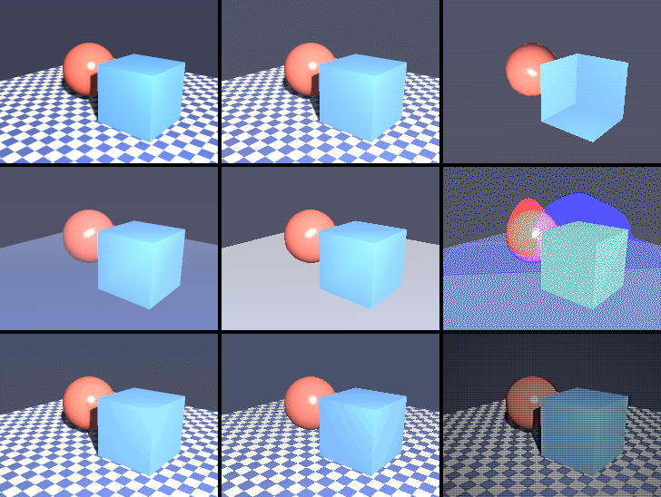

# Halcyon

> **This Addon is and always will be free. If you paid for this, you were
> scammed. Please demand your money back and report the seller.**

A from-scratch render engine for Blender that reproduces the output of
mid-to-late 1990s home-computer 3D software.

Not a filter over a modern render. A scanline z-buffer rasteriser with optional
ray tracing, the reflectance models those packages actually shipped, real
framebuffer quantisation, and a genuine GLSL/HLSL compiler for the coded-shader
nodes. 24,000 lines of Python and NumPy, no compiled dependencies.



---

## Install

Download the latest `halcyon-*.zip` from
[Releases](../../releases) — take the zip, not the source archive.

**Blender 5.1+ (extension):** Edit ▸ Preferences ▸ Get Extensions ▸ ▾ ▸
*Install from Disk…* and pick the zip.

**Any version (legacy add-on):** Edit ▸ Preferences ▸ Add-ons ▸ *Install…*,
pick the zip, then tick **Halcyon Render Engine**.

Then set **Render Properties ▸ Render Engine ▸ Halcyon**. If Blender's view
transform is not **Standard**, the Display panel will say so and offer a button
to fix it — Halcyon outputs display-referred pixels, so AgX or Filmic on top
double-transforms them. Open the *Halcyon
Presets* panel and load one — `VGA Mode 13h` or `PlayStation` show the
character of the engine fastest.

Requires Blender 5.1 or newer, and only NumPy, which Blender already ships. No
compiled dependencies, nothing to build.

### Running the tests

The renderer and the shader compiler import nothing from `bpy`, so the whole
suite runs on a plain Python with NumPy — no Blender, no display:

```
git clone <this repo> halcyon
python -m halcyon.tests.run_all
```

That is what CI runs, on Linux, Windows and macOS.

### Reporting a problem

Turn on **Developer Options** in Preferences ▸ Add-ons ▸ Halcyon, then use
**Run Self Test** in the Debug panel. It copies a report to your clipboard
covering your GPU, the shaders compiled on your own driver, per-stage frame
timings and thread scaling. Nearly every bug in this engine's history was
diagnosed from that output; almost none from a description alone.

---

## What it does

**18 shading models**, each implemented from its published formulation rather
than approximated:

Lambert · Gouraud · Flat · Phong · Blinn-Phong · Blinn · Cook-Torrance ·
Oren-Nayar · Minnaert · Ward · Anisotropic · Metal · Strauss · Multi-Layer ·
Toon · Translucent · Constant · Wireframe

Gouraud and Flat are treated as **shading rates**, not reflectance models,
because that is what they are. Selecting Gouraud on a material evaluates its
lighting once per vertex and interpolates the colour across the triangle;
selecting Flat evaluates once per face. That is where the banding and the
faceting genuinely come from, and it is why they look right instead of merely
blurry.

**106 node types** are evaluated, including the full Principled BSDF,
node groups (recursively), muted nodes, reroutes, all the texture and colour
nodes, and every Math and Vector Math operation. Nodes the engine doesn't know
pass their first matching input through and are reported as a warning rather
than failing the render.

**13 material templates** — Chrome, Gold, Brushed Metal, Glass, Shiny Plastic,
Rubber, Polished Marble, Varnished Wood, Terrain, Cel Shaded, Velvet, Hologram
and Wireframe. Built at runtime as recipes rather than saved node trees, so they
always match the current nodes.

**An infinite ground plane** — solid, checker, fractal or animated ocean —
intersected analytically in the background pass rather than built from geometry,
exactly as POV-Ray and Bryce provided one. World Properties ▸ Halcyon World ▸
Infinite Ground.

**Painter's Algorithm** alongside the z-buffer, comparing whole polygons rather
than fragments, with the sorting errors that implies. **Light linking** per lamp
by collection. **Fresnel, rim light, matcap, reflection tint, edge opacity and
backface override** on the master shader, all applied after the reflectance model
so they behave the same on every one.

**Material conversion.** Three buttons in the Material panel convert the active
material, everything on the selected objects, or the whole scene onto the
Halcyon Shader — relinking existing textures rather than discarding them, and
choosing the reflectance model from what the source shader actually was.

**13 procedural texture nodes** of the kind these packages shipped with —
Marble, Wood, Granite, Dents, Crackle, Plasma, Ripples, Starfield, Weave,
Scratches, Tiles and Spiral. Solid textures, evaluated in 3D, under
*Add > Halcyon > Halcyon Textures*. Plasma and Ripples animate.

**Coded shader nodes.** A real compiler — preprocessor, recursive-descent
parser, type inference, and NumPy code generation with SIMT execution masks.
Declare a uniform and an input socket appears, named and defaulted from the
declaration:

```glsl
uniform vec3 tint = vec3(1.0, 0.6, 0.2);
uniform float rimPower = 2.5;

in vec3 vNormal;
in vec3 vView;

out vec4 Color;

void main() {
    float rim = pow(1.0 - abs(dot(normalize(vNormal), normalize(vView))), rimPower);
    Color = vec4(tint * rim, 1.0);
}
```

That gives you a node with **Tint** and **Rim Power** sockets and a **Color**
output. Edit the source, press Compile, and the sockets rebuild while keeping
every link that still has somewhere to go.

**Six sky modes** — node tree, solid, gradient, Preetham physical sky, HDRI with
rotation and tint, and a full **Bryce atmosphere**: sky dome, sun corona, haze
that warms toward the sun, separate ground fog, a wind-streaked stratus deck, a
self-shadowed cumulus deck built from turbulence rather than fBm (which is where
the cauliflower edges come from), plus a rainbow at the correct 42 degrees and
stars.

**52 presets** across six categories — a Default that resets everything, then
3D software (Infini-D, Ray Dream, StudioPro, 3D Studio R4 and MAX R2, trueSpace,
LightWave, Imagine, POV-Ray 2.2 and 3.1, Bryce, ElectricImage, Softimage|3D,
Alias PowerAnimator, Wavefront, CINEMA 4D, Real 3D, Vistapro, Animation:Master,
Vue), home computers (VGA Mode 13h, Mac 8-bit and 1-bit, Windows 3.1 and 95,
EGA, CGA, Hercules, Amiga OCS and AGA, Atari ST, PC-98, X68000, SVGA, Quake
software), consoles (PlayStation and its high-res mode, Saturn, N64, Voodoo,
Dreamcast, 3DO, Jaguar), broadcast (Video Toaster, PAL, VHS, S-Video) and early
web (GIF, JPEG, PNG-8, CD-ROM FMV).

Applying a preset resets everything first, so presets never accumulate — machine
settings like thread count and Transparent Film are preserved. **Add On Top**
layers one deliberately.

**153 settings**, all exposed. A test fails if any of them is drawn in the UI without something reading it.

---

## Design notes

### The pipeline

```
supersample → rasterise z-buffer → reconstruct fragment attributes
→ evaluate node graph per material → collapse closure to a reflectance model
→ light → ray-traced reflection/refraction → A-buffer transparency → fog
→ filtered downsample
→ glow / star / flare (linear light)
→ display transform
→ colour depth + dither + palette      [the framebuffer]
→ composite NTSC encode/decode         [the cable]
→ interlace                            [the signal]
→ CRT mask, scanlines, curvature       [the glass]
→ JPEG artefacts                       [the file]
→ pixel aspect and nearest upscale
```

Glow happens before quantisation and scanlines after it. That is not a
stylistic preference — a 1996 machine glowed in its framebuffer and scanned on
its tube, and doing it in the other order looks wrong in a way that is hard to
name but easy to see.

### Closures to reflectance models

Blender's node graphs produce Cycles-style closures: additive, weighted lobes.
A 1990s renderer has one shader with a diffuse term and a specular term. The
translation sums the weighted lobes into those two slots and infers the model
from what the tree contains. It's in `core/render.py:closure_to_surface` and
documented there. It is an honest lossy mapping, not a pretence that the two
systems are the same.

Roughness maps to a Phong/Blinn exponent by the classic
`2/r⁴ − 2` relation, clamped.

### Transparency

A true A-buffer (Carpenter 1984). Every transparent fragment is shaded and
kept; fragments are then sorted per pixel and composited by layer rank. It is
correct through any depth of overlapping surfaces, unlike the per-object sorting
most period renderers used — which is also available, as `Painter's Algorithm`,
because its failures are part of the look.

### Shadows

Shadow maps are compared in **linear light-space distance**, not NDC z, so the
bias is a world-space number that means something. Normal-offset biasing —
stepping off the surface by a texel or so, scaled by how obliquely the light
hits — removes acne without the detached shadows a large depth bias causes.
Shadow maps and shadow rays agree to within 0.0015 mean difference on the test
scene, which is the real evidence that both are right.

Point lights get proper six-face cube maps.

### The bpy boundary

Everything under `core/` and `shaders/` imports NumPy and nothing else. No bpy.
The exporter flattens node trees into plain dicts, bakes colour ramps and curve
mappings into 256-entry LUTs, and hands over dataclasses. That boundary is why
the whole renderer can be tested headlessly, and it is the reason the test suite
below exists at all.

`properties.py` is **generated from the `RenderSettings` dataclass**, so the UI
cannot drift from the renderer. A test asserts every field has a matching
property.

---

## Running the tests without Blender

```bash
python3 -m halcyon.tests.run_all              # shader + renderer tests
python3 -m halcyon.tests.run_all --images out # ...and write demo PNGs
```

The suite covers the shader compiler (divergent control flow, loops with
per-lane trip counts, out-parameters, early return, structs, matrices, swizzle
assignment, discard, the preprocessor, both dialects, error reporting) and the
renderer (geometry landing where independently projected, shadows by both
methods agreeing, every shading model distinct, all six debug passes, affine
texture warp, vertex snapping, A-buffer transparency, ray-traced reflection,
node-graph evaluation including group recursion and unknown-node fallback,
palette colour counts, the full post chain, and all 52 presets rendering).

Set `HALCYON_DEBUG=1` to make node evaluation raise instead of falling back
silently — useful when a material isn't doing what you expect.

---

## The GLSL / HLSL subset

Verified working:

| | |
|---|---|
| Preprocessor | `#define` (object and function-like), `#ifdef`, `#ifndef`, `#if`, `#elif`, `#else`, `#endif`, `#undef` |
| Types | `float` `int` `uint` `bool`, `vec2/3/4`, `ivec`, `bvec`, `mat2/3/4`, `sampler2D`, user `struct` |
| HLSL aliases | `float2/3/4`, `float4x4`, `cbuffer`, semantics (`SV_TARGET`, `TEXCOORD0`, …) |
| Control flow | `if`/`else`, `for`, `while`, `do`, `break`, `continue`, `return`, `discard`, `switch` |
| Functions | user functions, `in`/`out`/`inout` parameters, overloading by arity |
| Arrays | declaration, indexing, assignment, **per-lane divergent dynamic indices** |
| Swizzles | read and write, `xyzw` / `rgba` / `stpq` |
| Derivatives | `dFdx`, `dFdy`, `fwidth` — real screen-space differences, not stubs |
| Extras | `noise3`, `fbm`, `quantize`, `posterize`, `dither4x4`, `hsv2rgb` |

Divergent control flow is handled with execution masks, so different pixels
genuinely take different branches and run loops for different numbers of
iterations.

**Not supported:**

- **Recursion.** Rejected at compile time with the call cycle named. Under SIMT
  masking every lane walks both sides of a branch, so a recursive call never
  reaches its base case.
- **Array constructor syntax** — `float[3](1.0, 2.0, 3.0)`. Declare and assign
  instead.
- Geometry, tessellation and compute stages. This is a fragment-shader
  language only.
- `sampler3D`, `samplerCube`, integer textures.
- Uniform block layout rules — `cbuffer` members are flattened to plain
  uniforms.

---

## Known limitations

These are real, and I would rather write them down than have you find them.

**The Blender layer is only partly validated here.** It was developed without
Blender installed. Every module is import- and registration-tested against a
`bpy` stub (`tests/fakebpy.py`) which catches typos, bad enum defaults and
malformed property declarations, and confirms all settings map across — but no
stub catches everything about a live API. Three real bugs were only found by
running it in Blender: an inverted image, a missing 1/π that whitened every
material, and a preview crash. If something misbehaves, the traceback in
Window ▸ Toggle System Console is the fastest way to tell me what happened.

**The GPU port is one stage of three.** The post chain runs on the GPU;
rasterisation and shading do not. See *GPU support* below. Everything else is
CPU, and threaded.

**Procedural textures differ slightly from Cycles.** Noise, Voronoi, Musgrave
and Magic are independently implemented from their published definitions. They
are the right *kind* of pattern with the right statistics, but they are not
bit-identical to Blender's, so a material tuned against Cycles will need a nudge.

**The Sky Texture is Preetham, not Nishita.** Blender's default sky option is a
full atmospheric scattering simulation. Halcyon implements the Preetham
analytic daylight model instead — in period, driven by the same sun elevation,
rotation and turbidity inputs, and close enough in shape and colour for output
that is about to be quantised to 256 colours. `altitude`, `air_density`,
`dust_density` and `ozone_density` are exported but unused.

**Volumetrics are screen-space.** A light's Volumetric setting throws shafts by
smearing bright pixels outward from its position on screen, which is how it was
done then. No volume is integrated.

**Depth of field is layered, not sampled.** The frame is split into depth slabs
and each blurred by its circle of confusion — a handful of blurs instead of
hundreds of rays, as compositors of the era did.

**Displacement drives a bump, not geometry.** The height becomes a normal
perturbation from its screen-space gradient. Nothing is tessellated, which is
also what 1990s scanline renderers did.

**Ambient occlusion is not period correct** and is off by default. It's there
because it's occasionally useful, not because a 1996 renderer had it.

**Motion blur, particles and hair are not supported.** Baking to texture is not
implemented either.

---

## Performance

The rasteriser has no per-triangle Python loop. Triangles are bucketed by
bounding-box size and every candidate pixel in a bucket is tested in one
vectorised sweep, with large triangles routed to a sequential path where the
per-triangle overhead is already amortised. Measured against the reference
implementation, on one CPU core:

| scene | before | after | |
|---|---|---|---|
| 782 tris, 320×240 | 0.29 s | 0.22 s | 1.3× |
| 18.7k tris, 640×480 | 2.43 s | 0.59 s | **4.1×** |
| 18.7k tris, 640×480 AA4 | 5.69 s | 2.20 s | **2.6×** |

The gain grows with triangle count, which is the case that matters: the old
path cost roughly 20 µs of Python overhead per triangle no matter how few
pixels it covered.

Both implementations are kept, and a test asserts they are **bit-identical** —
same triangle buffer, same depths, same barycentrics, same A-buffer fragment
set. If they ever diverge, the fast one is wrong and the suite says so.

### Threading, and why it does not help much

Shading runs across a thread pool, and the result is **bit-identical** at 1, 4
and 20 threads — a test asserts that. What it is not is faster, so **Threads
defaults to 1**. Measured on a 20-core machine at 640x480:

| threads | time | speedup |
|---|---|---|
| 1 | 0.283 s | 1.00x |
| 4 | 0.296 s | 0.96x |
| 16 | 0.303 s | 0.93x |
| 32 | 0.326 s | 0.87x |

More threads are slightly *slower*. NumPy releases the interpreter lock only for
large array operations, and the node evaluator is dominated by Python dispatch
between small ones — so the threads contend rather than divide the work. Giving
the pool more chunks to work with was tried, and measured worse still.

This was claimed to work for several releases on the strength of reasoning
rather than measurement, on a machine with one core where it could not have been
observed either way. It is written down here because it is the sort of claim
that quietly wastes someone's afternoon.

**Worker processes are the answer to this**, not threads: separate interpreters
have no shared lock at all. That path is described below.

Chunking still matters even at one thread: a 3440x1440 frame at 4x
supersampling is 79 million fragments, and building the shading context for all
of them at once would want tens of gigabytes. Peak memory is a function of chunk
size, not resolution.

### Rendering an animation

Two things matter for sequences. **Lock Palette** (on by default) builds the
adaptive palette once and reuses it, which stops colours crawling between frames
and skips rebuilding it every frame. The nearest-colour lookup cube it feeds is
cached alongside it, so only the first frame pays for either.

Turning **serpentine** off in the Colour Depth panel roughly halves the frame
again: in a single scan direction the error diffusion can be processed a
diagonal at a time rather than a pixel at a time, which is bit-identical and two
to three times faster.

A 640x480 frame at 4x supersampling with a 256-colour preset went from 6.4
seconds to 0.51 seconds this way, almost all of it in the palette stage rather
than the renderer.

### Worker processes

**Use Worker Processes** in the Performance panel splits each frame across
separate Python interpreters. Threads only parallelise where NumPy releases the
interpreter lock; processes have no shared lock at all. A worker is a plain
Python with NumPy — no Blender — which is possible only because `core/` and
`shaders/` are bpy-free.

Output is bit-identical to rendering in-process. If workers cannot start, or the
frame is too small to be worth splitting, it says why on the console and renders
normally. Off by default, because the speedup has not been measured on hardware
with more than one core.

Post-processing still runs in Blender's own process, so this helps most on
24-bit presets and least on heavily quantised ones where the palette stage
dominates.

### Finding out where the time goes

Switch on **Developer Options** in Preferences > Add-ons > Halcyon. That reveals
a **Debug** panel in Render Properties with the render passes, the scene dump and
the timing breakdown.

Turn on **Timing Breakdown** there and each frame prints a
per-stage table to the system console (Window > Toggle System Console). It
covers the export from Blender, texture preparation, shadow maps, rasterising,
shading, post and delivery, and names the slowest stage.

Use it before changing any setting. Three rounds of optimising this engine were
aimed at whichever stage happened to have been profiled, and twice that was not
the stage the frame was actually spending its time in.

### Where the time goes now

Shading, not rasterisation. The knobs that actually matter, in order:

1. **`aa_samples` is quadratic.** 4× supersampling means 4× the fragments to
   shade, not 4× the samples per fragment. Going from 1 to 4 roughly quadruples
   the render. Most of the presets ship at 4; drop it to 1 while you light the
   scene.
2. **`Pixel Scale` is free performance.** It renders at 1/N of your output
   resolution and scales back up with nearest-neighbour, so the output stays the
   size you set while the render costs N² times less. Set the output to
   1920×1080, Pixel Scale to 4×, and the engine renders 480×270 — 16× cheaper,
   and more authentic than rendering at 1080p and shrinking.
3. **Resolution.** Also quadratic, for the same reason.
4. **`shadow_map_size`.** Each map is a full rasterisation pass, and a point
   light needs six of them. 512 is usually plenty at these resolutions.
5. **Ray tracing.** Off unless you want reflections. Ray-traced shadows cost
   more than shadow maps and, as the tests show, agree with them to within
   0.0015.
6. **`preview_scale`** in the Performance panel controls viewport resolution.
   Raise it for a faster preview. The viewport also caches the exported scene
   and only rebuilds it when something actually changes, so orbiting no longer
   re-converts every mesh per frame.

### GPU support

Stage one of a GPU port is live, on Blender's own `gpu` module — the layer EEVEE
is built on. Cycles' device abstraction is C++ with precompiled kernels and is
not exposed to Python at all, so this is the only route an add-on has.

**GPU Post Processing** in the Debug panel runs the parallel post stages as GLSL.
Measured on an RTX 5060 Ti under Vulkan against the CPU function each replaces:

| stage | agreement | enabled |
|---|---|---|
| Display transform | 0.00001 max difference | yes |
| CRT mask, scanlines, vignette | 0.0115 | yes |
| Ordered dither and bit depth | 0.0327 | yes |
| Lens distortion | 0.318 | no |
| Composite NTSC | 0.287 | no |

A stage runs because it was measured, not because it was written, and a test
fails if anything unproven appears in the enabled list. Blender defaults to
**Vulkan**, where the legacy `GPUShader(vertex, fragment)` constructor does not
exist — shaders are built from a `GPUShaderCreateInfo`, with the old constructor
kept only as an OpenGL fallback.

Two stages remain, and they are where the time actually is:

| piece | difficulty | notes |
|---|---|---|
| Rasterisation to a G-buffer | moderate | there is already a bit-identical CPU reference to diff against |
| The 18 shading models | moderate | mechanical translation of formulas already written down |
| Coded-shader node | *easier* | it is already GLSL; today it compiles **to** NumPy, which stops being necessary |
| Node evaluator | hard | 106 node types would each need a GLSL emitter |
| A-buffer transparency | hard | needs depth peeling or per-pixel linked lists |
| Error-diffusion dither | does not port | inherently serial, and stays on the CPU |

Shading is over half of a typical frame, so nothing before the third stage will
move a render much.

---

## Layout

```
halcyon/
  core/          bpy-free renderer
    mathx.py       vector maths on (N,3) arrays
    scene.py       dataclasses the renderer consumes
    settings.py    RenderSettings — the 153 knobs
    raster.py      clipping, z-buffer, A-buffer fragment lists
    bvh.py         median-split BVH for rays
    texture.py     sampling, mips, N64 three-point filter
    shading.py     the 18 reflectance models
    lights.py      attenuation, shadow maps, PCF, ray shadows
    nodeeval.py    106 node types
    patterns.py    12 solid procedural textures
    render.py      the orchestrator
    post.py        glow, palettes, dither, NTSC, CRT, JPEG
    palette.py     median cut, octree, k-means, VGA/Mac/EGA/HAM
    dither.py      Bayer, Floyd-Steinberg, Stucki, Atkinson, …
  shaders/       bpy-free GLSL/HLSL compiler
    lexer.py parser.py gtypes.py builtins.py codegen.py compiler.py
  nodes/         Blender node classes
  presets/       the 52 preset definitions
  tests/         headless test suite + bpy stub
  compat.py properties.py export.py engine.py ui.py
```

---

## Licence

GPL-3.0-or-later, matching Blender.

---

## Credits

Built by Claude with help from Mr. Emotiman.

This Addon is and always will be free. If you paid for this, you were scammed.
Please demand your money back and report the seller.
