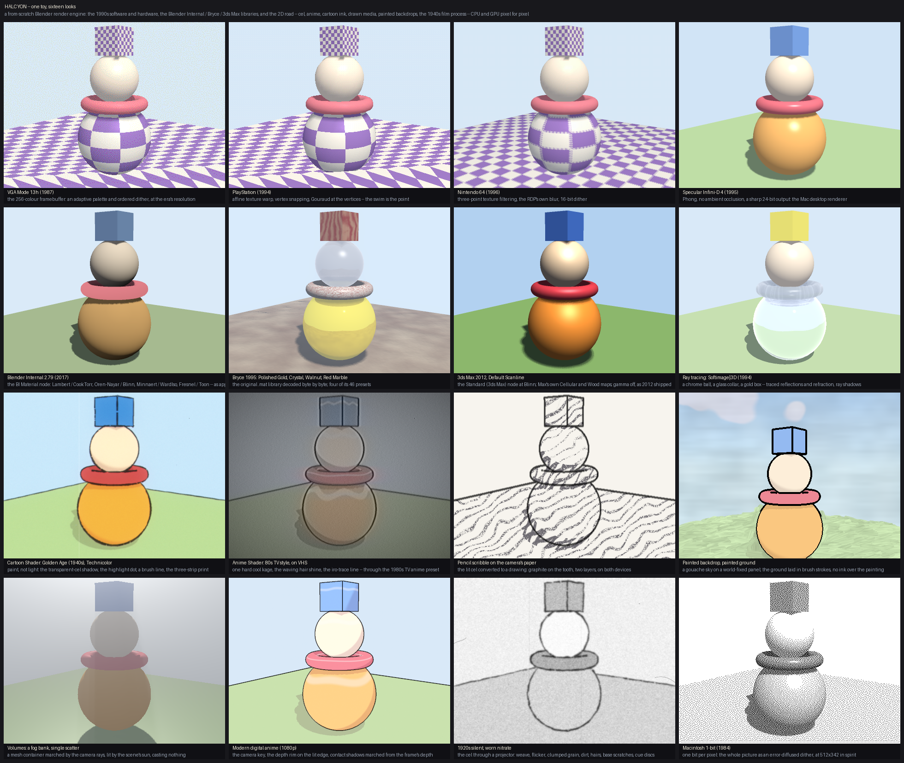
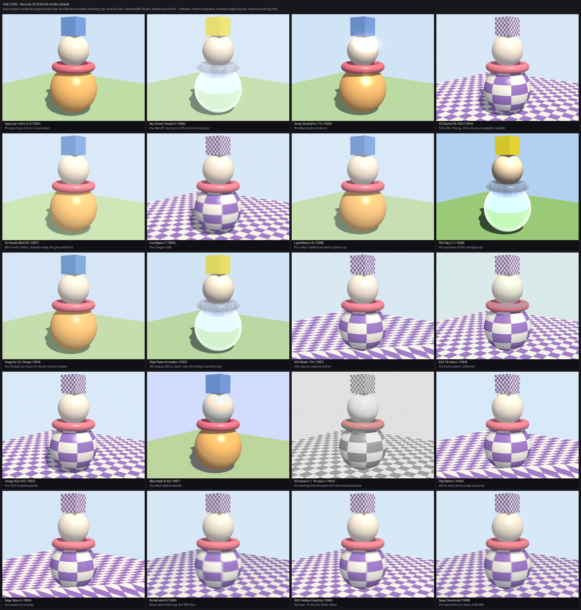
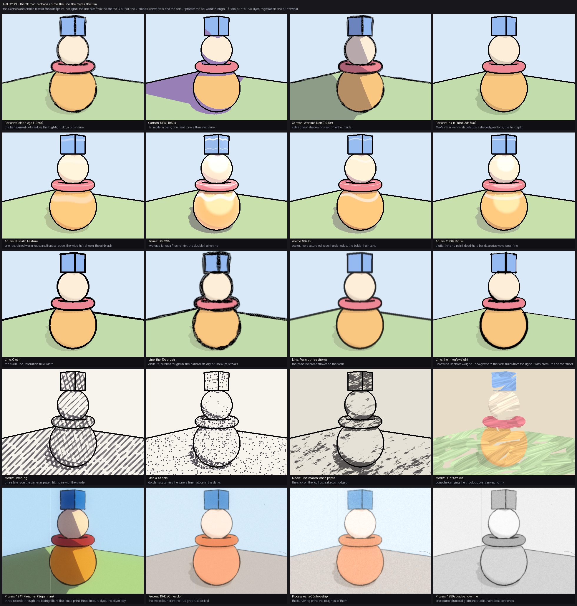
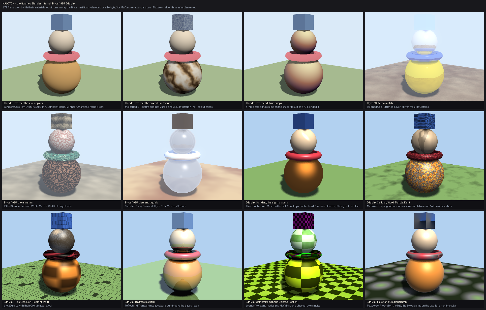

# Halcyon

> **This Addon is and always will be free. If you paid for this, you were
> scammed. Please demand your money back and report the seller.**

A from-scratch render engine for Blender, built for the looks Cycles and
EEVEE cannot give you: the 3D of every era before physically-based
rendering, and 2D — hand-drawn, painted, filmed — down to the wire.

Not a filter over a modern render. Halcyon is its own scanline z-buffer
rasteriser with optional ray tracing, the reflectance models the old
packages actually shipped, real framebuffer quantisation, a genuine
GLSL/HLSL compiler for coded-shader nodes, and a complete GPU port of all
three stages that is held to the CPU picture pixel for pixel — same frame,
same numbers, on either device, in any band, on any worker. Everything is
Python and NumPy, nothing compiled, and the whole engine runs headless
without Blender for its 5,000-check test suite.



**Three roads, one engine.**

- **The eras.** Ninety render presets, each what its target actually did —
  Infini-D, Ray Dream, 3D Studio R4 and MAX, trueSpace, LightWave, Imagine,
  POV-Ray, Bryce, Softimage, Alias, RenderMan; VGA, EGA, CGA, the Mac
  1-bit and 8-bit palettes, Amiga OCS/AGA/HAM, Atari ST, PC-98, X68000;
  PlayStation, Saturn, N64, Voodoo, Dreamcast; NTSC, VHS, the early web.
  Shading rates (Gouraud and Flat as *rates*, not models), affine texture
  warp, vertex snapping, three-point filtering, error-diffused and ordered
  dither, real palettes, HAM fringing, interlace, JPEG's DCT — the
  mechanism, never a blur.
- **The libraries.** Your **Blender 2.79 files open with their Blender
  Internal materials intact** — a plain File ▸ Append brings a scene saved
  twenty years ago in looking as it did: shader pairs, ramps, all eighteen
  texture slots on a ported BI texture engine, lamps at their true 2.79
  energies, the old world as sky and fog. The **Bryce 1995 material
  library**, decoded from the original `.mat` files byte by byte, sits on
  the Pre-Made shelf with the numbers Bryce saved in December 1995. And
  **3ds Max's material and map library** — the Standard material's eight
  shaders, the Raytrace material, Blend / Double Sided / Top-Bottom /
  Shellac / Composite, the maps, utilities and coordinate rollouts, a
  shelf of thirty-five nodes — runs on Max's own algorithms, reimplemented
  on Halcyon's own tables (no Autodesk code or data ships), with a 3ds Max
  2012 render preset.
- **The 2D road.** A **Cartoon Shader** (paint, not light: the Golden Age,
  UPA, Xerox-line, Saturday-morning, 90s feature, wartime noir and modern
  flat eras) and an **Anime Shader** (kage tones, the hair shine, the
  airbrush, a six-decade Style menu, and compatibility modes that decode
  real game texture conventions — ArcSys, Genshin, ZZZ); an **ink pass**
  drawn from the shared G-buffer — clean, brush and pencil lines that
  taper, roughen, drift, skip and boil, the inker's weight by the light,
  Arc System Works' vertex-colour line control; **2D media** converters
  that turn the lit cel into hatching, pencil scribble, stipple, charcoal,
  ink wash, paint strokes and paper; **painted backdrops** and painted
  grounds laid in brush strokes; and **the film the cel went through** —
  the three-strip camera's records and filters, the timed print curve,
  impure dyes, dye-transfer registration, the silver key, then grain by
  size and clump, dust on the cel, the negative and the print, hairs in
  the gate, scratches, cue marks, gate weave, flicker, frames held on
  twos and threes.







**At a glance:** 32 shading models · 243 node types evaluated (every shader
node Blender 5.x offers, plus Halcyon's own 137) · 90 render presets in
seven categories · 140 resolution presets · 113 Pre-Made material templates
in fourteen families · nine sky modes, 303 skies, 48 waters, nine infinite
grounds · real volumes (eight scattering models, mesh containers, voxels) ·
291 render settings, every one proven to change what it claims · a
5,373-check suite that runs without Blender · about 99,000 lines of Python
and NumPy (142,000 with the tests), no compiled dependencies.

---

## Install

Download the latest `halcyon-*.zip` from
[Releases](../../releases) — take the zip, not the source archive.

**Blender 5.1+ (extension):** Edit ▸ Preferences ▸ Get Extensions ▸ ▾ ▸
*Install from Disk…* and pick the zip.

**Any version (legacy add-on):** Edit ▸ Preferences ▸ Add-ons ▸ *Install…*,
pick the zip, then tick **Halcyon Render Engine**.

Then set **Render Properties ▸ Render Engine ▸ Halcyon**. If Blender's view
transform is not **Standard**, the Display panel will say so and offer a button
to fix it — Halcyon outputs display-referred pixels, so AgX or Filmic on top
double-transforms them. Open the *Halcyon Presets* panel and load one —
`VGA Mode 13h` or `PlayStation` show the character of the engine fastest.

Requires Blender 5.1 or newer, and only NumPy, which Blender already ships. No
compiled dependencies, nothing to build.

### Running the tests

The renderer and the shader compiler import nothing from `bpy`, so the whole
suite runs on a plain Python with NumPy — no Blender, no display:

```
git clone <this repo> halcyon
python -m halcyon.tests.run_all
```

That is what CI runs, on Linux, Windows and macOS.

### Reporting a problem

Turn on **Developer Options** in Preferences ▸ Add-ons ▸ Halcyon, then use
**Run Self Test** in the Debug panel. It copies a report to your clipboard
covering your GPU, the shaders compiled on your own driver, a 116-row
feature-by-feature comparison of the GPU picture against the CPU's, per-stage
frame timings and thread scaling. Nearly every bug in this engine's history was
diagnosed from that output; almost none from a description alone.

---

## Blender 2.79 appending — the headline feature

Blender removed the Internal engine in 2.80, and every .blend saved before
then carries materials modern Blender silently drops. Halcyon brings them
back, two ways:

**File ▸ Import ▸ Legacy Scene (.blend)** appends a 2.79-or-earlier file
through Blender's own loader — constraints, custom normals, modifiers, vertex
groups, parenting, animation and every object type arrive exactly as
File ▸ Append would bring them — while Halcyon reads the same file directly
for everything that loader drops:

- **Blender Internal materials, rebuilt one to one.** Diffuse and specular
  shader pairs (all the Internal menu's models), hardness, ramps with their
  inputs, blends and factors, mirror with Fresnel, transparency in Z and
  raytrace modes, emit, ambient, translucency, Shadeless, Shadows Only,
  ray-bias and shadow-bias terminator fixes, object colour, light groups —
  every panel field accounted for, transcribed against the 2.79 source code
  rather than approximated from memory.
- **All eighteen texture slots per material**, with their mappings,
  projections, influences and blend modes — and the procedural textures
  arrive on the **BI Texture node**, a port of the original texture engine:
  Clouds, Wood, Marble, Magic, Blend, Stucci, Noise, Musgrave, Voronoi and
  Distorted Noise over the original noise bases and lookup tables,
  colorbands included, verified CPU-against-GPU in the suite. Packed images
  unpack and travel; image sequences keep their settings.
- **Lamps with their real energies.** 2.79's lamp math — distance falloffs,
  sphere clipping, spot blends in cosine space, the quadratic sliders —
  is applied from the file's own DNA, so a scene lit for Internal is not a
  washed-out or pitch-black surprise. Ray and buffer shadows both convert,
  bias and softness included; pre-2.70 spot sizes convert their degrees.
- **The world comes along**: horizon and zenith as a Halcyon gradient sky,
  ambient into the lighting, mist as fog with its falloff, exposure and
  range, and the file's own colour-management settings mapped onto the
  engine's pipeline (a 2.4x-era file renders bytes-in bytes-out, exactly
  as it did).
- **The file's own framing**: render size, percentage, transparent film,
  and the saved "Selected Objects Only" state are honoured; hidden objects
  can come along or stay home, by checkbox.

**Plain File ▸ Append works too.** A watcher recognises a pre-2.80 file the
moment Blender finishes appending from it and fixes the lamps automatically —
no special import path required, and a **Fix Appended Lamps** button in the
Lighting panel covers anything appended before Halcyon was enabled. Every
import writes a full log to a text datablock, so what was converted — and
anything that could not be — is named, not guessed at.

---

## What it does

**32 shading models**, each implemented from its published formulation rather
than approximated:

Lambert · Gouraud · Flat · Phong · Blinn-Phong · Blinn · Cook-Torrance ·
Oren-Nayar · Minnaert · Ward · Anisotropic · Metal · Strauss · Multi-Layer ·
Toon · Translucent · Constant · Wireframe · Anime/Cel · Cartoon ·
Oren-Nayar-Blinn · the Blender Internal matrix (every 2.79 diffuse/specular
pair) · and 3ds Max's own eight — Phong, Blinn, Metal, Anisotropic,
Multi-Layer, Oren-Nayar-Blinn, Strauss, Translucent — on Max's light loops

Gouraud and Flat are treated as **shading rates**, not reflectance models,
because that is what they are. Selecting Gouraud on a material evaluates its
lighting once per vertex and interpolates the colour across the triangle;
selecting Flat evaluates once per face. That is where the banding and the
faceting genuinely come from, and it is why they look right instead of merely
blurry.

**243 node types** are evaluated — 102 of Blender's own, audited against its
full surface-node registry, and the audit came back clean: every shader node Blender 5.x offers
has an evaluator except Freestyle's stroke UV, which has no meaning outside
Freestyle. That includes the full Principled BSDF, node groups (recursively),
muted nodes, reroutes, all the texture and colour nodes, and every Math and
Vector Math operation. Nodes the engine doesn't know pass their first matching
input through and are reported as a warning rather than failing the render.
A second audit stands behind the first: every property a Halcyon node
declares must reach the renderer — a node whose dial changes nothing fails
the build with the dial named.

**The master shader** carries the era's whole bag of tricks on one node —
Fresnel, rim light, sheen, matcap, reflection tint, edge opacity, backface
override, vertex colour mix — all applied outside the reflectance model so they
behave the same on every one. **Bump Height** takes any greyscale texture and
bumps it straight into the shading normal: behind the scenes it becomes a real
Bump node between the texture and the Normal chain, so it renders identically
on both devices by construction. The Material Properties tab drives the same
material with plain sliders when **Override** is on — override withholds the
node tree at export, so what the panel shows is exactly what renders.

New materials created while Halcyon is the active engine are **born as master
shader materials** — the panel's New button builds one directly, and a
strictly-guarded watcher converts factory-fresh default materials (exactly the
two untouched default nodes; anything a person has edited is never touched).

**The Anime Shader (1.62)** is a second master node, built for the
2000s-2020s 3D-anime look rather than the 1990s one: N·L wrapped and cut
into two or three tone bands whose shadow COLOURS multiply the base — a
shadow is a colour, never a darkness — with a stepped cel highlight, rim,
matcap, line art, per-material Light Response, and an emission road. Its
**Compatibility mode decodes real game texture conventions**: the ArcSys
ILM/SSS maps of the Guilty Gear Xrd lineage and Dragon Ball FighterZ
(channel semantics from the published shader recreations of the GDC 2015
pipeline), the HoYo character lightmaps of Genshin Impact (decode taken
from the PrimoToon shader source) and Zenless Zone Zero (per its modding
guides), and the Dragon Ball action games — Kakarot, Sparking! Zero —
served by the ArcSys-lineage decode their looks descend from, with their
tooltips saying exactly that rather than inventing channel dumps nobody
has published. Plug a game's own ILM or lightmap into Game Texture and
the channels mean what they meant at home; every mode shades identically
on CPU and GPU, per-pixel texture decode included. Vertex-colour AO
(the Xrd painters' convention) and alpha-is-emission (the HoYo one) ride
checkboxes. **The ramp road (1.65)**: link a texture — the game's own
ramp, a ColorRamp, any chain — into **Shadow Ramp** and the tone bands
come from the ramp itself, baked once into a LUT the lamp loop samples
by the light term; shadow side, transition and lit side are all painted,
exactly the games' convention. **Ramp Row** picks the row of a multi-row
ramp, and under GENSHIN the Game Texture's alpha — the material id,
exactly where the game keeps it — picks the row automatically: the
per-row character ramps travel at last. Both devices sample the same
baked texels.

**The Max study, second reading (1.86)** — the field supplied Max
2012's own map and shader algorithms (the MetaSL/HLSL ports that ship
with Max), and the 3DS Max shelf now runs them step for step on
**Halcyon's own hash-derived tables — no Autodesk code or data ships**.
Every 3D map rides Max's 512-lattice gradient noise (Perlin's 1989
noise as max_texutil carries it, 3D and 4D with Phase as time);
**Cellular** is Max's Poisson Worley (point counts per cell, squared
distances, the fractal sum by lacunarity, a Variation control and a
Cell ID output); **Dent**, **Planet** and **Wood** ride Max's
20-periodic linear noise; **Smoke**, **Speckle**, **Splat**,
**Stucco**, **Swirl**, **Checker** (Max's two checks per tile, the
integrated Soften), **Tiles** (Max's mortar geometry, Line Shift,
Random Shift, Color Variance) and **Waves** (wave sets seeded by the
C runtime's rand(), so the same seed places the same sets) follow
their originals; five maps are new — **Marble**, **Perlin Marble**
(the thirteen-knot spline), **Wood**, **Dent** and **Gradient Ramp**
(Max's eleven gradient shapes on a three-flag ramp). **Falloff**
gains Max's exact Fresnel equation, Max's Distance Blend order (Side
near, Front far) with Extrapolate, and Shadow / Light (the Light
Meter's road, CPU-only by name); **Output** gains Output Amount and
Alpha From RGB in Max's order, **Mask** scales the alpha too. Sizes
are Max's Size (coordinate over Size) at Max's own defaults over 100.
The master shader gains **the eight Standard shaders as new models**
— Phong, Blinn, Metal, Anisotropic, Multi-Layer (with its second
highlight's own sockets), Oren-Nayar-Blinn (Max's Oren-Nayar with the
interreflection term), Strauss and Translucent (with a Translucent
Color), each labelled "(3ds Max)" — on Max's own light loops, on both
devices. Every twin is held to its NumPy original at the bit where
the maths allows, and the GLSL simulator itself gained a float32
discipline on the way (a Python literal in a vector constructor used
to promote a lane to float64). Every road that did not change holds
bitwise against 1.85.0. Then, on the field's second ask, **Max's own
material panels as nodes**: **Standard (3ds Max)** — the Standard
material 1:1 with its rollouts (Wire, Faceted, the eight-shader
menu, Ambient/Diffuse/Specular with the lock, Self-Illumination as
Max's own lerp or as a colour, Opacity, Specular Level, Glossiness,
Soften, each shader's extras, Opacity Falloff, IOR, the Diffuse and
Bump map amounts, Reflection) — and **Raytrace (3ds Max)** (Reflect,
Luminosity and Transparency as colours, the way Max reads them),
both showing Max's labels and units over the master's identifiers so
the bake machinery treats them exactly as the master (a linked
percentage refuses the GPU by name rather than shading raw); the
node at Blinn renders bitwise the master at MAX_BLINN. The shelf's
last maps on Max's own algorithms: **Gradient** (with its noise and
`sramp` threshold), the **Composite map** (Max's twenty-five blend
modes and its "over"), **Color Correction** (Max's HSL, Standard and
Advanced lightness), **Vertex Color**, and the **XYZ Coordinates**
rollout in Max's matrix order — and, so Object XYZ could shade on
both devices, **the object frame now reaches the GPU** (the Texture
Coordinate node's Object output had been answering world position
there, a silent split on any moved object). A **3ds Max 2012, Default
Scanline** render preset at 2012's own defaults, gamma off as it
shipped. 35 nodes on the shelf.

**The Max study (1.85)** — 3ds Max's material and map library, from
the 2012 reference rollout by rollout, under a **3DS Max submenu** of
the Halcyon Add menu (which now leads the Add menu instead of
trailing it). *Materials*: **Blend** (two materials by a Mix Amount
or a mask, with the mixing curve's Lower/Upper zone), **Double
Sided** (a Facing and a Back material, Translucency letting each show
through), **Top/Bottom** (by the normal's up, with Position and
Blend), **Shellac** (the second material's colour added by Color
Blend) and **Composite** (a base and four layers, each Additive or
Mix by its Amount). *Textures*: **Noise** (Regular/Fractal/Turbulence
with fractional Levels, Low/High thresholds, Phase), **Cellular**
(Circular or Chips, Spread, Fractal iterations, Roughness, the
Low/Mid/High cut into Cell and two Division colours), **Smoke**,
**Speckle**, **Splat**, **Stucco**, **Swirl** (Twist, Intensity,
Amount, Constant Detail, Center, Contrast, seed), **Planet** (three
water and five land colours by depth and height, Ocean %, Island
Factor, Blend), **Waves** (wave sets on a sphere or circle,
wavelength range, Amplitude, Phase), **Checker** (with Soften) and
**Tiles** (Stack, Running, English and Flemish bonds, counts, gaps,
Holes, Fade Variance) and **Falloff** (Perpendicular/Parallel,
Towards/Away, Fresnel, Distance Blend, against the view or a world
axis). *Utilities*: **Mix** with the mixing curve, **RGB Tint**,
**Output** (Level, Offset, Invert, Clamp), **Mask** and **RGB
Multiply**. *Vectors*: the **Coordinates** rollout (map channel,
object or world XYZ, screen; Offset, Tiling, Mirror, W Angle). Every
map's GLSL twin is held to its NumPy original point by point and
every node to the CPU frame on the deferred pass. The master shader
gains Max's **Oren-Nayar-Blinn** model and a **Faceted** flag, and
the Cartoon Era menu gains **Ink 'n Paint** at Max's own defaults
(with a shelf recipe). Housekeeping the field asked for: the
texture shelf is categorised (Noise & Fractal; Stone, Wood & Organic;
Tiles & Fabric; Sky, Water & Effects; 2D Media), Matcap Coordinates
lives in the Vector family and the BI Texture in the Blender
Internal family. One engine change came out of the study: an Add
Shader of two Halcyon masters now SUMS their colours on the CPU as
the GPU always did (it averaged before — a silent divergence the
Shellac road exposed); every mix holds bitwise.

**The hair pass, the film scans and the tooltips (1.84)** — three
finishing fronts. The **hair highlight** grows up: the angel ring's
edge takes a **Shape** menu (the smooth wave it always had, plus the
zigzag "W" highlight of 90s TV, the scalloped run of petals, and the
hard stepped notch of the digital era), a **Hair Shine Angle** that
turns the wave's phase around the head (stagger the notches on a
second character with nothing else changed), a **Hair Shine Follow**
that lets the band ride up and down with the key light's height —
0 is the painted band that ignores lighting, exactly as before; it
listens to the scene key's elevation and stays put under a purely
positional lamp — and a **Hair Shine Second Color** so the echo band
below can carry its own tint rather than a copy. The **Cartoon
master takes the whole hair bag** — all eleven sockets, the same
code — because the American tradition airbrushed hair too. Both
devices render every new road identically; every knob at its default
is bitwise the 1.83.0 engine. The resolution shelf gains **24
formats**, including a whole **Film Scans** group (35 mm Full
Aperture and Academy in 2K and 4K, Super 16, and the CinemaScope 2K
scan whose 2:1 anamorphic pixels un-squeeze on the way out — render
spherical, deliver scope), the missing home computers (Amstrad CPC,
VIC-20, the Atari ST's three modes, Sharp X68000, NEC PC-88), the
handheld and console gaps (TurboGrafx-16, 3DO, Game Gear, Lynx,
WonderSwan), the laptop panels every deck actually shipped on
(1366×768, 1600×900, XGA+, WQXGA, QSXGA) and the modern ultrawides
(DQHD, 5K2K, the 4:5 social portrait). And **every option in the
add-on now explains itself**: every socket on the three master
shaders, every node property, every enum entry, every render, world,
material and light setting carries a written tooltip — applied to
old files' nodes the moment they load, and enforced by the suite so
a thin tooltip is a failing test from here on.

**The preset expansion (1.83)** — more of both traditions, on one
menu each. The Anime Shader gains a **Style menu** (the Cartoon
Era menu's idea for the anime decades): *80s Film Feature* (one
restrained warm kage under the optical printer's softness, matte
paint, a wide gentle hair sheen, a breath of airbrush), *80s TV* (the
hard cool-violet tone and the waving angel-ring), *80s OVA* (the
video market's glamour: two kage tones, a Fresnel rim, a double hair
shine, airbrush both sides), *90s TV* (cooler, more saturated, a
bolder simpler hair band), *2000s Digital* (dead-hard bands, the
early RGB palettes' desaturated kage, a crisp waveless shine), and
*Modern* (a gently softened tone, the depth rim, the marched contact
shadows and the camera key — the current pipeline in one click).
Every value is a starting point; the menu never touches your paints,
textures or the key's angle, and the shadow colours are multiply
tints, so one style serves any palette. The Cartoon Era menu grows
**Wartime Noir** (the dark 40s theatrical short: a deep hard
transparent shadow pushed onto the lit side) and **Modern Flat** (one
barely-darker cool tone over heavily simplified forms — the
thin-uniform-line era). Five more **Cel & Film** render presets
bracket the century: the worn silent nitrate with the projectionist's
cue discs, the 35 mm anime feature, the 2000s digital transition (no
film in the chain at all), the modern 1080p master with its one fine
grain sheet, and the modern flat TV cartoon. Three new shelf recipes
tie in, generated from the same tables so the shelf and the menus can
never drift (112 templates).

**The Xrd study (1.82)** — the Guilty Gear techniques, from the
sources themselves: Motomura's GDC talk and Arc System Works' own
line-control deck. **Line Control** (the material's Ink row): the
mesh's vertex colours steer the line exactly as ASW paints them —
ALPHA multiplies the width (0.5 the width as set, 1 double, 0 erases
the line at that vertex: a glove's rim, a sleeve's opening), BLUE
holds interior and marked lines back until the surface turns toward
its silhouette (their hull's depth push — the nose line that only
draws in profile); silhouettes always keep their line, and Halcyon's
screen-space ink never needs their distance compensation. **Vertex
Colour AO now works under every Compatibility mode** — the GDC talk's
"offset on the Threshold" for hand-painted models, no game texture
required. **Face Shadow (SDF)** on the Anime Shader: the modern anime
face's terminator is DRAWN in a map, not found on the normals — link
the game's own face map (or any gradient chain) and it sweeps with
the key's angle about the head's frame (Face Forward / Face Up),
mirrored across the face's centre line, exactly the convention Guilty
Gear and the HoYo titles share; cast and screen shadows still land on
it. And the study's foundation was already here: **hand-edited custom
split normals travel** — Blender's Data Transfer from a sphere, the
Normal Edit modifier, any sculpted normals reach both devices, and
because Halcyon's line is a post-process, edited shading normals
never bend the outline (Xrd needed a second normal set for that; a
distance-field line gets it by construction).

**The cel's light (1.81)** — better shadows and better lighting for
the 2D shaders, the way the drawings and the 3D-anime pipelines
actually do them. A hand-drawn cel is not lit by lamps in a room: the
key is decided per shot, its cast shadows are drawn shapes, and the
silhouette carries a rim. The Cartoon and Anime Shaders now name their
**Shading Light**: *Scene Lamps* (as before), *Camera Key* — one key
fixed to the camera by **Light Azimuth** and **Light Elevation** about
the screen, so the character is lit the same way on screen wherever
the camera goes — or *World Key*, fixed in the world. Under a fixed
key the lit tone is the paint as painted, and the scene's lamps only
CAST: their shadow maps still fall across the cel. **Screen Shadow**
is the drawn contact shadow — the hair's across the brow, the chin's
on the neck — marched from the frame's own depth toward the key over
**Screen Shadow Length** pixels: what is nearer along the way shadows
the pixel, crisp and close, on both devices from the same field. **Rim
Mode ▸ Depth Rim** is the anime rim: a band **Rim Width** pixels wide
just inside the silhouette, wherever the surface a few pixels along
the screen is farther — a line of light that keeps its width whatever
the form, on the *Lit Side*, the *Shadow Side* or *Both*. **Smoothing
Shape** gives Shadow Smoothing a *Sphere* (as before), an upright
*Cylinder* (the terminator runs straight down a limb) or *Facing the
Camera* — the anime face rule, the whole face one lit plane with only
the drawn shadows on it. The Cartoon Shader gains the Anime Shader's
**Airbrush** (colour, width and side) against its own shadow edge.
Three templates carry the recipes: Cel Camera Key, Cel Anime Face,
Cartoon Rounded Feature. Every existing file renders bitwise as
before.

**The print's wear (1.80)** — the 40s arc's last front and the
field's ask (*"the grain and hairs need to be much more customizable
and interesting"*). Display ▸ Cel Film ▸ **Print Wear**, each thing
where it happened to the film: **Grain** is the negative's silver
printed through — a sheet of grains of Grain Size, a Grain Clump share
in clumps, each record's own sheet by Grain Chroma (coloured grain, the
way three negatives print), density noise strongest where half the
grains developed and nothing at the clear gate or at D-max, so a
print's whites and blacks are clean. **Dust** in three populations: Cel
Dust sat on the cel under the rostrum camera and stays for every frame
of a hold; Negative Dust blocked the printer light and prints clear —
one record's colour missing under the three-strip process; the rest is
dirt on the print, fresh per frame. **Hairs** are caught in the
projector gate: anchored at the aperture's edge, dancing for their Hair
Hold, about Hairs at a time. **Scratches** run the frame's height at
one place for their Scratch Hold, on the emulsion side taking the dye
away (neutral on a dye-transfer print, one colour on a two-colour one,
blue on a chromogenic one) or on the base side scattering the lamp.
**Reel Length** puts the projectionist's cue marks top right — four
frames, eight seconds and one second before every reel's end. Sizes are
given at 1080 lines and scale with the frame's height. The chain now
runs in the order the light met it: cel dust, optics, process, grade,
the print's wear, dirt, weave, hairs, flicker.

**The colour process (1.79)** — the film look rebuilt around what
actually happened to the cel, the study's fourth rank and the field's
own complaint (*"the coloured ones don't really work well, it doesn't
look like the cartoons do"*). Display ▸ Cel Film ▸ **Colour Process**:
not a grade but the chain — the camera's black-and-white **records**
through their red, green and blue filters (a successive-exposure or
three-strip camera; the filters' cross-talk included, and **Filter
Sharpness** for the taking filters' cut: sharp-cutting filters separate
the records further than the eye separates the colours — the three-
strip's more-than-life saturation, from the filters, not a saturation
dial), **halation** in the negative's base (each record's bright areas
veil their surroundings in their own colour), the timed print's
**curve** to a dye amount (the Hurter–Driffield straight line of Print
Gamma in log exposure, pinned so a white cel prints clear and no light
prints Dye Density, the H&D toe between; a mid grey prints at
0.18^gamma — 1.5 is the theatre's dense print, 1.3 that print as a
telecine shows it), the dye-transfer print's
three dyes with their documented **unwanted absorptions** (a cyan that
also eats some green and blue, a magenta that eats red and blue, a
yellow that eats green — balanced so a grey scale prints neutral and
only colours shift: reds deep, greens darker and toward cyan, blues
toward purple; Dye Purity walks toward the process's ideal dyes), the
**silver key**
printed from the green record under the dyes, the dye layers'
**registration** error (every edge, the ink line included, fringed in
colour — the honest misregistration of a printed cartoon), and the
**projector** (the screen's white is the clear gate of a normally timed
print). **Two-colour** is the same chain with two records and two dyes
— Cinecolor and the 1930s two-strip: no true green, skies cyan, foliage
olive, skin salmon; its dyes' green absorptions are the process, not an
impurity. Exposure is the timer's printer light in stops: down prints
the whole frame denser and darker, up thinner and paler. Three new Cel &
Film presets — *1941 Fleischer (Superman)*, *1940s Cinecolor short*,
*early-30s two-strip Technicolor* — and the 1940s Technicolor feature
preset takes the process instead of the grade. The 1.73 stock grades
are untouched and still there for the video era.

**Media 2 (1.78)** — the study's second media front. **Direction** on
Hatching and Pencil Scribble: *Form* runs the strokes along the
silhouette-parallel tangent (the normal crossed with the view — the
isophote direction of the classic pen drawing, which wraps a sphere like
latitude and follows a cylinder's length), *Slope* runs them down the
form; a turning direction cannot be one lane field, so the node keeps
twelve coherent fields at 15-degree steps and cross-fades the two a pixel
sits between, and a stroke never breaks. **Indication** on every
converter — Winkenbach and Salesin's rule that a drawing shows detail
only where the artist indicates it: link any mask (an inverted Facing
draws near the silhouettes and leaves the middle bare; a vertex colour
paints where). **Placement: Count** on Stipple is Secord's stippling —
dots of one size whose number carries the tone, from three nested
lattices in a fixed order so a darkening tone only ever adds dots and the
crowd is evenly spread at every density. **Blend** on Pencil Scribble and
Charcoal is Sousa and Buchanan's tortillon: graphite taken off the paper's
peaks and pushed into its valleys — the stroke keeps half its contrast
and a soft halo appears around it; the charcoal's tooth flattens to an
even tone. Every twin held to media.py; nodes saved before the sockets
read Indication 1 and Blend 0 and grow the sockets at load; four shelf
recipes (Form Hatching, Indicated Hatching, Counted Stipple, Smudged
Pencil). And the GLSL front-end refuses a call with the wrong number of
arguments now, as every driver does — it used to zero-fill them.

**The inker's line (1.77)** — the Imitation Study's line arc 2, chosen
by the field as the front after the backdrop. Three roads to a line
that is *"dynamic and occasionally rough"* instead of traced. **Light
Weight** is Goodwin's isophote distance (NPAR 2007): every silhouette
point walks inward along the surface's own normal until the key lamp's
light returns (Shadow Level), and the line is as heavy as that walk is
long — heavy on a broad shadowed flank, a quarter width on the lit side
and on thin features, heavier near than far, all from one measurement;
the walk stops at the object's edge and at any depth step. Three more
line sources on the Outline panel, each an interior class at the
Interior Scale on both roads: **Form Lines** (the valleys of the facing
|n·v| — DeCarlo's image-space suggestive contours, found with Steger's
sub-pixel valley detector so the line is one pixel wide and the
silhouette's own fall-off never fires), **Shadow Lines** (the terminator
inked, as the cel inker traced the painter's shadow boundary) and **Tone
Lines** (a flow-guided difference of Gaussians on the shaded frame —
Kang's FDoG, Winnemöller's XDoG — one pixel wide on the dark side of
every tone step, a line only where the step is within one surface). And
**the stroke road**: the contour is read as a graph (every pixel and the
runs of its eight neighbours — two runs a path, one an end, three a
junction) and everything after is a local operation on it, so a pooled
band draws what the frame draws: **Smooth** (Taubin's shrink-free
smoothing of the pixel staircase, corners pinned), **Pressure** (the
net turning of the chain — a staircase's jogs cancel, a curve keeps its
rate, a corner its whole angle — bears the pen down through curves and
leaves a blob at every corner), **Overshoot** (true ends, chains
arriving at junctions and both edges of every corner run past it along
their tangents, tapering, about half of them, each by an amount hashed
from the point on the surface, so animation holds), and the seeds are
drawn back carrying their **origin** pixel so every width, colour and
depth lookup still reads a surface. **Anchor: Surface** samples the
line's noises (weight, roughness, drift, gaps) at the surface point
under the line instead of the screen — Kalnins' coherence without a
previous frame. Also: the shadow-side weight and the Light gradient
read the smooth normal and a point lamp's true direction now (a point
lamp's rotation was being read as its direction). Every dial band-
invariant bitwise, deterministic, off by default: the plain and styled
lines are the previous release bitwise.

**The painted backdrop, the painted background road, the setback (1.76)**
— the pagoda's first tell was its sky, a flat tint in a frame that was
otherwise drawn. World ▸ **Painted Backdrop** is a background painting on
a flat panel in front of the camera (aim it with Panel Direction): the
gradient brushed in gouache — the brush's streaks along a stroke angle,
optional impasto dabs — painted clouds from a stretched three-octave
field, dry-brushed or airbrushed at the edge, lit on top and shadowed
beneath by the field's own vertical difference, the board's tooth, and a
watercolour granulation applied as pigment density in Bousseau's law
(C′ = C − (C − C²)(d − 1)). A pan crosses the painting and a tilt climbs
it, the way the animation stand's background did; behind the panel the
plain gradient continues, the back of the stage. Four looks on a menu:
Gouache Day, Watercolour Dusk, Fleischer Night, Storyboard. Evaluated per
direction on the CPU on both device roads like every rich sky — exact by
construction; mirrors reflect it by the same road. **Paint Mode** on
every material: *Cel* (everything as before) or *Background*, which
takes the **painted background road** (Display ▸ Painted Backgrounds):
the surface's lit colour laid down as brush strokes Meier's way
(SIGGRAPH 1996) — particles fixed on the surface, one hashed sequence per
triangle cut to the screen density the stroke size asks, so a camera
that comes closer adds strokes at the end of every sequence and never
moves one already there; each drawn far to near at a screen-constant
size over an abstracted base, its direction from the colour's contours,
the surface's silhouette or a fixed angle, bristle-streaked, drying
toward its end, lightened or darkened by its own hash — with the ink
suppressed on the painting unless the material says Always. The
**setback** is the Fleischer lens on the miniature: Background materials
and the sky soften by eye distance while the cels stay sharp, a masked
Gaussian so nothing bleeds across the cel's edge. One CPU pass from the
shared G-buffer before the ink on either device road; band-invariant
bitwise; a cel pixel is never touched; the default paint mode is the
previous release bitwise. And the media nodes gained a third **Space**,
*View* — the camera's sphere, the eye-to-point direction octahedrally
unfolded — Lucas Pope's Obra Dinn answer to the shower door: turn the
camera and the marks stay on the scene.

**The 2D media (1.75)** — the verdict's second sentence: *"there should
be textures/converters specifically for 2D-looking things — paint
strokes, pencil scribbling, charcoals, inking"*. Seven texture nodes on
the Halcyon Textures shelf, five of them **converters** with a per-pixel
**Tone** input (lightness, 1 = bare paper — a Shader to RGB luminance, a
Screen Info Facing, a dot with a light direction): **Hatching** (pen
cross-hatching that fills in layer by layer as the tone darkens — the
tonal art map, continuous — each stroke wobbling, varying in pressure,
drawn in lifted segments, breaking dry, and swelling to solid ink over
the last fifth of the range), **Pencil Scribble** (hatch lanes bent by a
curling domain warp that folds into loops past Curl 1, fanned in shallow
layers, the graphite catching the paper's tooth so light pressure
speckles and heavy pressure fills), **Stipple** (dots on a jittered
lattice whose *density* carries the tone, a finer lattice closing the
darks, the dots merging into solid at the very end the way a stippler
reaches black), **Charcoal** (the stick depositing on a four-part paper
tooth, peaks first, streaked along the stroke, smudged by a thumb,
banded by its own pressure), **Ink Wash** (flat washes by level, pigment
pooling inside every edge, settling into the granulation, the edges
wandering with Bleed); and two textures: **Paint Strokes** (brush dabs
on a jittered lattice, later over earlier through a two-deep painter's
composite, turned off the angle by a hashed *slope*, bristle-streaked,
drying toward their ends — link a lit colour into Color 2 and the
strokes carry it, the gouache road) and **Paper** (tooth, fibres, mottle
as a height). Every one has a **Space**: the Vector input (the marks on
the surface) or **Screen**, the camera's own paper — Scale cells across
the frame's height whatever the resolution — and a **Boil** that redraws
the marks every N frames through the salt, so a drawing boils on its own
clock like the line does; a **Seed** keeps two materials' hatching from
being the same hatching. Every field is the integer hash the pattern
library rides, so every one travels to the GPU exactly — the seven GLSL
twins are held against the NumPy originals on random points and whole
materials against `render()`; a linked dial refuses by name, the boil
rides the frame uniform (no recompile per frame), Screen space is
band-invariant bitwise. Seven **2D Media** shelf recipes: five shadeless
drawings on a Facing tone (hatched, pencil, charcoal, stippled, wash),
a Gouache Background, and Drawing Paper with its own relief.

**The drawn line (1.74)** — the verdict on the ink pack was "decent, but
they look artificial; old cartoon outlines are dynamic and occasionally
rough", and this round answers it on the distance-field road. **End
Taper / End Length**: the brush lifts and lands — every stroke end and
junction is found on the contour itself (a segment has two, a line that
vanishes behind an object ends where it meets that object's contour, a
closed silhouette has none) and the line thins toward them.
**Roughness / Roughness Scale**: three octaves of edge irregularity, in
*patches* — a slow field decides where the line gets rough, so it is
occasionally rough rather than uniformly hairy. **Drift**: the hand
wanders — the line's centre moves in and out of the true contour, the
same on both sides of the line. **Gaps**: dry-brush skips, short breaks
where a fine noise runs high, more readily where the stroke is thin.
**Line Texture**: solid ink, *Brush Streaks* (lighter streaks running
along the stroke — the along coordinate is the source pixel's, the
across coordinate the signed distance, so the streaks run parallel and
unbroken through the line's centre) or *Charcoal* (a soft bloom around
a dark core, the paper's tooth breaking the body). Every dial is a hash
of pixel, phase and seed: band-invariant bitwise, the same frame the
same line; every default is the previous release's line bitwise. The
Cel & Film presets draw with them.

**The era looks (1.73)** — the cel arc's last front: the cel
*photographed and printed*. Render Properties ▸ Display ▸ **Cel Film**.
**Film Stock** is the stock's colour response in linear light —
Technicolor's purified primaries and cyan shadows, a faded 70s
Eastmancolor print (magenta cast, lifted blacks), the 80s telecine, a
VHS dub, or black-and-white panchromatic negative — with a Stock Amount
mix. **Softness** is the rostrum camera's optics (a Gaussian, sigma in
pixels); **Gate Weave** shifts the whole frame by a per-frame
registration error; **Dust & Hairs** puts dirt, clear scratches and the
odd hair on the print by density (per film area: about forty specks on
a 1080p frame at 1); **Grain** is the emulsion, seven parts luminance to
three parts colour, mean-preserving; **Flicker** is the projector lamp.
**Shoot On** 2 or 3 is the animator's economy made literal: a held frame
is *not rendered* — the key frame's cel is photographed again (the film
stages still run per frame, so grain, dust and weave keep moving) and an
animation on twos renders in half the time; render sequences from their
first frame, and a frame whose key frame is missing says so and renders
fresh. The **Paint** box works before the ink: **Paint Misregistration**
slides the painted colour by a per-frame error under lines that stay
where the drawing put them, **Paint Bleed** softens the paint under and
past the line. The **Print** box is the newsstand: **Halftone** lays four
ink screens at the classic angles (cyan 15°, magenta 75°, yellow 0°,
black 45°), each dot's area its ink's coverage with the classic inversion
above 50%, full under-colour removal, reproducing every grey within a
percent; **Halftone Pitch** is the cell in pixels. Every stage is a pure
function of the frame number and the seed — the same frame renders the
same bits on either device, in any pooled band — and every default is
off: the frame is bitwise the previous release's. Six **Cel & Film**
render presets set a period at once: 1930s black-and-white, 1940s
Technicolor feature, 1970s Saturday morning (on threes, through the
composite chain), 1980s OVA on LaserDisc, 1980s TV anime on VHS, and
the comic print. The full Technicolor chain costs about 0.35 s at 1080p;
the dot screen about 0.5 s.

**The 80s additions to the Anime Shader (1.72)** — the cel arc's third
front. **Hair Shine** paints the angel ring: a band of the shine colour
across the object at a fraction of its own height (Height), Width wide,
its edge waving around the object (Wave, Waves per turn), on the
camera-facing surface, fading only on the underside — light-independent,
because it was painted on the cel at a position, not lit — with a
thinner **Second** band that far below. **Airbrush** lays the cel
painter's soft gradation against the first shadow edge: on the lit side
the tone multiplies toward the airbrush colour just above the edge and
fades out toward full light, on the shadow side the shadow tone blends
toward it approaching the edge, or both (Airbrush Side), Width in light
units. **Shadow Smoothing** is the Cartoon Shader's inker's road, shared.
And the **Line Colour** menu: *Ink Settings* (as before), *Iro-Trace* —
this material's ink line in its own shaded colour per pixel, darkened
by Line Darken (hair lines in the hair's tone, skin lines in the skin's,
the 80s coloured trace line; it runs the distance-field ink road), or
the *Line Color* socket as a constant of the material's own. Every
addition is neutral at its default: a node saved before them shades
bitwise as it did, and old files grow the sockets at load. GPU twins
for all of it, per-pixel amounts and colours included. Two shelf
recipes, **Cel 80s Hair** and **Cel 80s Skin**, arm them. On the way, a
latent fix to the per-material ink road: a silhouette line now belongs
to its nearer surface on the mask road too, so a material's coloured or
widened line is whole on its sky side (it was half the global line).

**The Cartoon Shader (1.71)** is the third master node and the OTHER
tradition — "a 40s Looney Tunes cartoon is vastly different to an 80s
anime". Its colour is **paint, not light**: flat, the same under every
lamp whatever its energy (a lamp at 40 W paints the same cel a lamp at
2 W does). Where the key lamps do not reach, one painted **shadow
tone** lands, by mode: **Transparent Cel** (paint × Shadow Color by
Shadow Amount — the Golden Age shadow cel, a second exposure through a
tinted overlay), **Painted** (a second flat paint replacing the first —
UPA and the television decades), or **None** (flat paint everywhere —
limited animation at its cheapest). Shadow Threshold is where the edge
falls on the wrapped light term (0.5 the terminator, higher pushes the
shadow onto the lit side), Shadow Softness airbrushes it, and **Shadow
Smoothing** bends the shading normal toward a sphere around the object
so the terminator sweeps a form as one clean shape the way an inker
simplifies it (a sphere is its own smoothed self, bitwise; a cube gets
a curved terminator across a flat face). The **highlight is a painted
dot**, not a reflection — Highlight Size is its radius (0.3 ≈ a
17-degree dot, 1.0 a 60-degree cap), Highlight Softness feathers it, and it only lands
inside the lit region of the lamp that makes it. Across lamps the paint
keeps the **strongest lamp's verdict** (a region is lit if any lamp
reaches it — the paint never brightens past paint), and **Lamp
Influence** is the one road back toward lit shading: 0 is pure paint,
1 lets the lamps' energy and colour modulate the LIT paint — the
shadow tone is a colour and stays one. Rim, emission and
opacity ride the master's shared tail. An **Era** menu writes the
sockets to a named starting point — Golden Age (1930s-40s), UPA Modern
(1950s), Xerox Era (1960s-70s), Saturday Morning (1970s-80s), 90s
Feature, 90s TV (Dark Deco) — and the sockets stay yours afterwards.
Shades identically on CPU and GPU, per-pixel chains into Shadow Color,
Shadow Amount, Shadow Threshold, Shadow Smoothing, Highlight Color,
Highlight Size and Lamp Influence included; a chain into a softness
socket refuses the driver by name. The master shader's model menu
carries **Cartoon (Paint)** too, running the node at its defaults.

**Convert to Halcyon chooses its shader your way (1.62).** The Material
panel's converter grew a Detection switch: **Automatic** keeps reading
the source shader (Principled roughness becomes Glossiness, Glass
becomes Blinn, Toon becomes Toon), **Set Shader** forces one chosen
model — any of the 19, the Anime/Cel bands included — onto everything it
converts.

**140 resolution presets in nine categories (1.62, 1.84)** — the shelf grew
from 75: the handhelds and arcade boards (NES at its true 8:7 PPU
pixel, Game Boy, GBA, DS, PSP, Neo Geo, CPS-2, Virtual Boy), the 8-bit
micros (ZX Spectrum, C64, MSX, Apple II, Atari 8-bit, BBC Micro Mode 0
with its double-tall pixels, NEC PC-9801), DVD and the anamorphic tape
formats (HDV 1440×1080 at 4:3 pixels, DVCPRO HD), bake textures to 4K,
DCI cinema, 5K/8K, ultrawide 21:9, vertical 9:16 and A3/US-Letter print.

**Cartoon outlines.** Ink drawn from the renderer's own G-buffer: object
silhouettes, material borders, depth breaks and normal creases, each its own
toggle, with width, colour, opacity and over-sky control. **Marked Edges**
draws the edges you marked — Freestyle edge marks, Sharp, creases — as
interior ink, hidden-line-removed by the z-buffer's own verdict (each pixel
measures its exact distance to its own triangle's marked edges; a marked edge
behind a wall simply is not there). And **every material has a say**: Ink
mode (follow / always / never — one inked character in a plain scene, or
clean glass in an inked one), its own ink colour, its own width. The ink
lands at the *internal* resolution, so supersampling anti-aliases the line on
the way down — clean cel edges with no line renderer. Computed from the same
buffers on either device, so the picture cannot differ between them. Render
Properties ▸ Shading ▸ Cartoon Outlines, and the material panel's Ink row.

**113 material templates on the Pre-Made shelf** — Add ▸ Pre-Made in the
shader editor, sorted into fourteen families (Metal, Mineral, Glass,
Water, Liquid, Wood, Cloud, **Cel & Anime**, **Cartoon**, **2D Media**,
**Volumes**, Terrain, Surfaces, Effects). Picking one drops its nodes beside your
existing graph rather than replacing it. The **Cel & Anime** shelf
(1.68) is the Anime Shader one click deep — a skin/cloth/metal cel trio
plus ArcSys and HoYo starters with their compat modes armed, and (1.72)
the 80s hair and skin with the shine band, the airbrush and iro-trace
lines armed; the
**Cartoon** shelf (1.71) is the Cartoon Shader one click deep, one
recipe per era — Golden Age, UPA Modern, Xerox Era, Saturday Morning,
90s Feature, 90s TV — generated from the node's own era table so the
shelf and the Era menu can never disagree; the **Volumes** shelf drops a
Halcyon Volume wired to the output's Volume socket — Fog Bank, God Ray
Chamber, Cel Fog, Ember Glow, and (1.69) Fire on the Combustion model,
Murky Air, and a Voxel Cloud on a 12-cube lattice — so any mesh becomes
a marched container.
The engine's own 28 — Chrome through Wireframe, Water, Lava, Tile Floor,
Brick Wall, Hammered Metal, Leopard, Cloth, Dead Channel — plus:

**The Bryce 1995 library, decoded — 46 presets.** The original preset
collection ships as MetaTools CCmF containers, and Halcyon's parser
(`core/brycemat.py`) cracks them completely: the RLE preview thumbnails,
the 976-byte material records (diffuse/ambient/specular colours, the
per-channel specular coefficients, transparency, reflection, bump, the
metallic flag, the refractive index — pinned by diffing the teaching
presets against their own 1995 manual text), and the texture records
with their exact colour tables, frequencies and octave counts. Polished
Gold through Kryptonite carry the stored numbers: the glass ladder
refracts at 1.12/1.52/1.68, Water at 1.33, Diamond at 2.55, and
Kryptonite is the anisotropic reptilian-scale crackle its own colour
table says it is. Preset notes quote the original library descriptions.
Built at runtime as recipes rather than saved node trees, so they always
match the current nodes, and every one is rendered by the test suite to
prove it changes the frame.

**34 procedural texture nodes**, 27 of the kind these packages shipped —
Marble, Wood, Granite, Dents, Crackle, Plasma, Ripples, Caustics, Starfield,
Weave, Scratches, Tiles, Spiral, Cells, TV Static, Fur Tufts (the shell-fur
field: round strand cross-sections that taper per layer) and the POV-Ray
family (Bozo, Agate, Leopard, Onion, Bumps, Wrinkles, Brick), plus:

- **Fractal Noise** — the integer-hash fractal in three profiles, on a
  **1D, 2D, 3D or 4D lattice** with a W socket. The hash travels to the GPU
  bit-for-bit, which Blender's own sin-fract noise cannot.
- **Water Noise** — 1 to 12 drifting layers folded toward crests by
  Choppiness, with animation Speed and a **Loop** that closes the cycle
  *exactly* over Loop Frames by moving time onto a circle through the
  lattice's fourth dimension. A looping deck breathes and shimmers in place
  rather than drifting; that trade is stated on the node.
- **Gradient (Shaped)** — linear, reflected, spherical, quadratic, square,
  diamond, conical and spiral falloffs with Centre, Rotation, Scale,
  clip/repeat/ping-pong and easing.
- **Matcap Coordinates** — sphere-map UVs from the view-space normal, now
  with an Offset socket and a **Centered** switch, so a Spherical gradient
  fed the vector lands centred instead of cornered.
- **The 2D media (1.75, 1.78)** — Hatching, Pencil Scribble, Stipple,
  Charcoal, Ink Wash (converters on a per-pixel Tone and an Indication),
  Paint Strokes and Paper, each with a Space (surface, the camera's paper
  or the camera's sphere), a Seed and a Boil; hatching and scribble with a
  Direction (angle, form, slope), stipple with a Placement (size, count),
  pencil and charcoal with a Blend.

Each pattern is written from its published definition rather than from
something that looks similar. Agate's 0.77 exponent is the whole character
of that pattern. And where the published definition looked nothing like the
real thing, the real thing won: **Leopard draws true rosettes** — curved
dark arcs broken around a warmer interior patch, the odd solid spot between,
a gentle domain warp bending every ring organic — with ground, ring and
Interior colours on separate sockets and the ring mask on Fac, instead of
POV-Ray's summed-sines polka dots.

**30 more nodes in two families (1.60).** Fifteen **Utilities** — among
them a **Light Meter** that reads how lit the surface actually is at shade
time (Fac and per-lamp Color out, optional shadow test), which is the whole
trick behind glow-in-the-dark and light-reactive materials; a Timer,
Oscillator, Counter, Pulse, Gate, Selector, Color Key, Measure, Step Ramp,
Wobble, Frame Blend, Blackbody, Compare and On Frame. Light Meter reads the
lamp list at shading time, so the GPU plan refuses it by name and that
material shades on the CPU. And fifteen **Vector** nodes — among them
**Array**, which lays a decal's UVs out along a line, grid, circle, square,
polygon or star with per-copy jitter and rotation (made for stamping image
decals; following seams, creases or sharp edges needs mesh edge flags the
exporter does not carry yet, and is stated on the node rather than faked);
plus Mirror Tile, Kaleidoscope, Polar, Twirl, Lens, Ripple Warp, Wave Warp,
Tile Random, Snap, Shear, Orbit, Region, Projector and Spin.

**The Add menu is families now.** Add ▸ Halcyon opens Pre-Made, then
Shading, Blender Internal, Utilities, Vector, Retro Screen and Textures as
submenus — 92 nodes (64 shader, 27 texture, BI Texture) sorted where a
person would look for them, and a census test proves every registered node
is reachable from exactly one family.

**Colour tools with taste:** a **Color Ramp (Spaces)** node blends up to six
stops in RGB, **OKLab**, **OKLCh** (hue taking the short way round) or HSV —
stop colours are sockets, so they can be driven — and a **Blur** node that
truly re-evaluates whatever is plugged into it at shifted points in the
surface plane, procedural or image alike, at three tap qualities. Blur's
re-run is CPU work and says so: the GPU plan refuses it by name and that
material shades on the CPU.

**Coded shader nodes.** A real compiler — preprocessor, recursive-descent
parser, type inference, and NumPy code generation with SIMT execution masks.
Declare a uniform and an input socket appears, named and defaulted from the
declaration:

```glsl
uniform vec3 tint = vec3(1.0, 0.6, 0.2);
uniform float rimPower = 2.5;

in vec3 vNormal;
in vec3 vView;

out vec4 Color;

void main() {
    float rim = pow(1.0 - abs(dot(normalize(vNormal), normalize(vView))), rimPower);
    Color = vec4(tint * rim, 1.0);
}
```

That gives you a node with **Tint** and **Rim Power** sockets and a **Color**
output. Edit the source, press Compile, and the sockets rebuild while keeping
every link that still has somewhere to go. Coded shaders compile natively into
the GPU's deferred pass too, mangled and inlined, so the same source runs on
both devices.

**Nine sky modes** — node tree, solid, gradient, **banded gradient** (the same
blend cut into the handful of flat steps a 256-colour palette could actually
spare for a sky), **starfield**, Preetham physical sky, HDRI with rotation and
tint, and a full **Bryce Sky Lab**: sky dome, sun corona, haze that warms
toward the sun, separate ground fog, a wind-streaked stratus deck, a
self-shadowed cumulus deck built from turbulence rather than fBm (which is
where the cauliflower edges come from), a rainbow at the correct 42 degrees,
stars, comets that travel their own great circles off the scene's clock — and
now a **nebula wash** under the Bryce dome as well as the starfield, because a
night preset that sets nebula settings should get a nebula. The ninth,
the **Painted Backdrop** (1.76), is described with the 40s arc above.

**303 sky presets, every one with a rendered thumbnail.** The original 43 plus
**260 new skies in 26 authored families** — Golden Hour, Blue Hour, High Noon,
Storm Front, Ember, Midnight Clear, Vapor Dream, Winter Overcast, Desert Dusk,
Alien Twilight, Monsoon, Candy, Nebula Night, Fog Bank, Thunderhead, Moonrise,
Cinema Grade, Arctic Night, Sea Dawn, Toxic, Haze Valley, Comet Watch, Cirrus
Day, After the Rain, Noir and Spring Front — each variant carrying its own
tooltip. The preset picker is a browsable gallery: the engine's own sky module
drew all 303 thumbnails, and a test holds the library to it — real fields only,
real notes, a thumbnail per key, and every preset must actually change the sky
it is applied to. *Save As...* writes a `.halsky` anywhere, *Add to Library*
puts one beside the built-ins. Applying a preset refreshes the rendered view
immediately — it tags the world the way a slider does, which for a long time it
did not.

**48 water presets** in the same shape, under the water plane rather than the
Sky Lab because that is where Bryce kept them — including a Bryce-1995-shaped
ocean set. Skies and waters own disjoint halves of the world, so applying one
never disturbs the other.

**Nine infinite grounds, and they answer the scene's lighting** — solid,
checker, fractal, **tiles** with grout width, grout glow and per-tile
shading (thin bright grout past glow 1 *is* the synthwave neon floor),
**dunes** with a ridge-strength dial, **snowfield** with sun-glints in
their own colour and sparkle amount, **lava** with pulsing cracks, ember
colour and crack-width dials, a **Material** ground that evaluates any
picked material's node graph to the horizon, and the full **animated
ocean**: a directional wave spectrum fanned off a wind direction, deep
and shallow colours with the path length between them, and the sun's
glitter found in the distribution of wave normals rather than painted
on. All intersected analytically in the background pass, exactly as
POV-Ray and Bryce provided one — and, unlike theirs, lit by the scene:
every lamp's falloff, the hemi wrap, the area-lamp form factor, and
**cast shadows from geometry**, ray-traced or shadow-mapped per lamp,
with a Scene Lighting dial whose zero restores the self-lit flat look
bit for bit. The self-luminous parts — lava heat, neon grout — keep
burning inside shadows.

**Weather** — rain, snow, embers and ash as a screen-space particle
field composited in front of the finished frame, layered for parallax,
resolution-true, and a pure function of (seed, layer, index, time): the
same frame renders identically across runs, devices and supersample
factors, and scrubbing the timeline is stable because nothing
integrates.

**A terrain generator** — Add ▸ Halcyon ▸ Terrain drops a fractal
heightfield in seven landforms (mountain, hills, canyon, dunes with a
wind direction, crater, volcano, plateau), deterministic per seed and
ready-wired to the **Altitude & Slope** node, which grades a material by
height and steepness — with an optional noise socket to roughen the band
edges, and a ColorRamp downstream is the classic snow-line in two nodes.

**Halo materials** — the era's glow sprites, splatted against the
frame's own depth: images, noise breakup, colour ramps over radius,
rays, star spikes, lightning bolts, shockwave rings, halos along curve
objects, and lens flares that sample their lamp's visibility off the
z-buffer. A sky-only scene can flare; a halo behind a wall cannot.

**Animation, told honestly** — sequence renders print per-frame time and
a completion estimate that knows the first frame pays for the caches the
rest reuse (shadow maps, BVHs, compiled shaders), so the ETA converges
on the truth instead of the warm-up cost.

**The image-as-palette road** — point the quantiser at any image and the
whole render is forced through that image's colours; an image-editor
operator turns any picture into a one-pixel-per-colour palette table to
feed it. Both dither roads clamp before they quantise and before they
diffuse, so an unrepresentable hue becomes the nearest palette colour
instead of a smear.

**90 render presets** across seven categories — 3D software (Infini-D, Ray
Dream, 3D Studio, MAX R2 and 3ds Max 2012, trueSpace, LightWave, POV-Ray,
Bryce, Softimage|3D and the rest), home computers (VGA Mode 13h through PC-98
and X68000), consoles (PlayStation, Saturn, N64, Voodoo, Dreamcast…),
broadcast (Video Toaster, PAL, VHS), handhelds, the early web (GIF, JPEG,
CD-ROM FMV), and fourteen Cel & Film presets from worn silent nitrate to
the modern digital master. Applying one resets everything first, so presets
never accumulate.

**Render passes** — Depth, Normal, Position, UV, Object Index and Material
Index, written under Blender's own names and channel layouts so a Halcyon Z
pass drops into a comp built for Cycles without rewiring.

**291 settings, all exposed, all proven, all explained.** Two tests stand
behind that sentence: one holds every setting to a proof that it changes what
it claims to change (a matrix row, an A/B render, a behavioural check, or a
declared reason — nothing silently exempt), and one fails the build the moment
any property ships without a detailed tooltip.

**Legacy import: any 2.79-or-earlier .blend, materials included** — the
headline feature, described in full above: File ▸ Import ▸ Legacy Scene, the
automatic fix-up on plain File ▸ Append, Blender Internal materials and all
eighteen texture slots rebuilt one to one, lamps with their real energies,
and the old world as sky, ambient and fog.

---

## Design notes

### The pipeline

```
supersample → rasterise z-buffer → reconstruct fragment attributes
→ evaluate node graph per material → collapse closure to a reflectance model
→ light → ray-traced reflection/refraction → A-buffer transparency → fog
→ cartoon outline ink                  [from the G-buffer, both devices]
→ filtered downsample
→ glow / star / flare (linear light)
→ display transform
→ colour depth + dither + palette      [the framebuffer]
→ composite NTSC encode/decode         [the cable]
→ interlace                            [the signal]
→ CRT mask, scanlines, curvature       [the glass]
→ JPEG artefacts                       [the file]
→ pixel aspect and nearest upscale
```

Glow happens before quantisation and scanlines after it. That is not a
stylistic preference — a 1996 machine glowed in its framebuffer and scanned on
its tube, and doing it in the other order looks wrong in a way that is hard to
name but easy to see.

### Determinism

The same frame renders the same pixels — across runs, across thread counts,
and across devices. That is a doctrine with machinery behind it, not a hope:

- Every stochastic effect (soft shadows, AO, dither jitter) draws from an
  integer hash that is a pure function of (pixel, sample, stream, seed), and
  angles come from a shared 256-entry table rather than anyone's `sin`.
- Ties are **named rules, not races**. The rasteriser resolves coverage ties
  to the lowest triangle id; the ray tracer resolves equal-distance hits the
  same way — the answer is a function of the candidate set, never of
  traversal order or scheduling.
- Where a driver's last-bit arithmetic genuinely cannot decide reproducibly —
  a reflection ray grazing two coincident surfaces — the GPU **routes the tie
  to the CPU** and returns the reference's own answer by construction.
  Route, never guess.
- Every internal data texture on the GPU is read by `texelFetch` with integer
  coordinates, never through a sampler whose filter state the Python API
  cannot control. That one is written in scar tissue: a filtered read of the
  triangle-id buffer once drew a faint wireframe over every edge of a scene,
  visible only at resolutions the test suites never rendered.

### Closures to reflectance models

Blender's node graphs produce Cycles-style closures: additive, weighted lobes.
A 1990s renderer has one shader with a diffuse term and a specular term. The
translation sums the weighted lobes into those two slots and infers the model
from what the tree contains. It's in `core/render.py:closure_to_surface` and
documented there. It is an honest lossy mapping, not a pretence that the two
systems are the same.

Roughness maps to a Phong/Blinn exponent by the classic `2/r⁴ − 2` relation,
clamped.

### Transparency

A true A-buffer (Carpenter 1984). Every transparent fragment is shaded and
kept; fragments are then sorted per pixel and composited by layer rank. It is
correct through any depth of overlapping surfaces, unlike the per-object
sorting most period renderers used — which is also available, as `Painter's
Algorithm`, because its failures are part of the look. Screen Door
transparency punches dither-pattern holes instead: no sorting, no blending,
pure period.

**Alpha Clip (punch-through)** is the material panel's other alpha mode, and
the era's cheap one: the alpha chain is tested against a threshold and the
surface is either fully there or fully absent. Its pixels resolve in the
z-buffer *before* shading and shade once — no layers, no sorting, no
per-layer GPU passes — which is exactly why fur, foliage, fences and cut-out
sprites cost almost nothing on 1990s hardware. Fur Shells materials use it
automatically; the suite holds the clip road pixel-identical to the
A-buffer's answer on hard-alpha scenes.

### Shadows

Shadow maps are compared in **linear light-space distance**, not NDC z, so the
bias is a world-space number that means something. Normal-offset biasing —
stepping off the surface by a texel or so, scaled by how obliquely the light
hits — removes acne without the detached shadows a large depth bias causes.
Shadow maps and shadow rays agree to within 0.0015 mean difference on the test
scene, which is the real evidence that both are right. Point lights get proper
six-face cube maps, and the same depth images travel to the GPU as atlases.

### Rays

The BVH builds by **binned surface-area heuristic** — a median split over a
scene with a huge ground plane produces sibling boxes that overlap almost
entirely, and the profiler measured shadow rays paying for both subtrees all
the way down. The SAH tree made the field scene's shadow rays 12× faster and
its reflection rays 6×, on both devices at once, because the GPU kernels
traverse the same packed tree. Traversal on the CPU runs level-synchronous
waves of (node, ray) pairs — a few dozen large array operations per query
instead of thousands of small ones.

### The bpy boundary

Everything under `core/`, `shaders/` and the numerical half of `gpu/` imports
NumPy and nothing else. No bpy. The exporter flattens node trees into plain
dicts, bakes colour ramps and curve mappings into 256-entry LUTs, and hands
over dataclasses. That boundary is why the whole renderer can be tested
headlessly, and it is the reason the test suite below exists at all.

`properties.py` is **generated from the `RenderSettings` dataclass**, so the
UI cannot drift from the renderer. A test asserts every field has a matching
property; another asserts every property has a reader inside the engine, which
is how seven corpse settings were found and removed.

---

## Running the tests without Blender

```bash
python3 -m halcyon.tests.run_all              # shader + renderer tests
python3 -m halcyon.tests.run_all --images out # ...and write demo PNGs
```

The suite covers the shader compiler (divergent control flow, loops with
per-lane trip counts, out-parameters, early return, structs, matrices, swizzle
assignment, discard, the preprocessor, both dialects, error reporting) and the
renderer (geometry landing where independently projected, shadows by both
methods agreeing, every shading model distinct, all debug passes, affine
texture warp, vertex snapping, A-buffer transparency, ray-traced reflection to
any depth, node-graph evaluation including group recursion and unknown-node
fallback, palette colour counts, the full post chain, the generated period
objects, all 86 templates rendering, all 303 skies applying and differing, all
75 presets, every setting's proof, and every tooltip's existence).

The GPU pipeline is tested headlessly too: the same GLSL the driver compiles
is executed by the compiler's own NumPy backend against the same packed
textures — raster kernel, deferred shading, ray kernels, post stages — so a
change that would move a GPU pixel fails the suite on a machine with no GPU at
all. The final word still belongs to hardware: **Run Self Test** renders the
116-row feature matrix on your actual driver and reports any row where the
two devices disagree.

Set `HALCYON_DEBUG=1` to make node evaluation raise instead of falling back
silently — useful when a material isn't doing what you expect.

---

## The GLSL / HLSL subset

Verified working:

| | |
|---|---|
| Preprocessor | `#define` (object and function-like), `#ifdef`, `#ifndef`, `#if`, `#elif`, `#else`, `#endif`, `#undef` |
| Types | `float` `int` `uint` `bool`, `vec2/3/4`, `ivec`, `bvec`, `mat2/3/4`, `sampler2D`, user `struct` |
| HLSL aliases | `float2/3/4`, `float4x4`, `cbuffer`, semantics (`SV_TARGET`, `TEXCOORD0`, …) |
| Control flow | `if`/`else`, `for`, `while`, `do`, `break`, `continue`, `return`, `discard`, `switch` |
| Functions | user functions, `in`/`out`/`inout` parameters, overloading by arity |
| Arrays | declaration, indexing, assignment, **per-lane divergent dynamic indices** |
| Swizzles | read and write, `xyzw` / `rgba` / `stpq` |
| Derivatives | `dFdx`, `dFdy`, `fwidth` — real screen-space differences, not stubs |
| Textures | `texture`, `texelFetch`, `textureSize`, `textureLod`, `textureGrad` |
| Extras | `noise3`, `fbm`, `quantize`, `posterize`, `dither4x4`, `hsv2rgb` |

Divergent control flow is handled with execution masks, so different pixels
genuinely take different branches and run loops for different numbers of
iterations.

**Not supported:**

- **Recursion.** Rejected at compile time with the call cycle named. Under SIMT
  masking every lane walks both sides of a branch, so a recursive call never
  reaches its base case.
- **Array constructor syntax** — `float[3](1.0, 2.0, 3.0)`. Declare and assign
  instead.
- Geometry, tessellation and compute *user* stages. User shaders are
  fragment-language only (the engine's own kernels use compute internally).
- `sampler3D`, `samplerCube`, integer textures.
- Uniform block layout rules — `cbuffer` members are flattened to plain
  uniforms.

---

## GPU support

**The port is complete: rasterisation, shading and post all run on the GPU**,
through Blender's own `gpu` module — the layer EEVEE is built on, and the only
route an add-on has. Set **Device: GPU** in Render Properties and the three
stage toggles come on together.

- **Rasterisation** runs as a compute kernel producing the same G-buffer the
  CPU produces — triangle ids, perspective-correct barycentrics, depth at the
  chosen precision, the affine-warp interpolants, snap and 16-bit modes
  included. Coverage at shared edges is governed by the same watertight window
  and canonical clip rules on all four engines (CPU loop, CPU batch, GLSL
  kernel, NumPy replay), because a half-ulp disagreement near the near plane
  once opened pixel-wide cracks.
- **Deferred shading** packs the G-buffer into textures and shades one
  full-screen pass per material, every frame constant baked into the shader
  source. Lights, shadow atlases (cube faces included, every Vogel PCF tap
  reproduced), image textures with the CPU's own filter arithmetic, vertex
  colours, per-pixel surface parameters, the master shader's whole colour
  chain, coded GLSL nodes inlined natively, and the ray sweeps — reflections
  and refractions to any depth, traced by compute kernels against the same
  SAH tree, with each level's secondary passes scissored to the pixels its
  rays actually hit.
- **Post** runs the parallel stages as GLSL, measured stage by stage on real
  hardware before each was allowed to default on. Error-diffusion dither is
  inherently serial and stays on the CPU, honestly.

The whole matrix — 116 feature rows — is compared against the CPU picture by
**Run Self Test** on your own driver. A row that cannot yet run on the GPU is
*routed*: the frame says why on the console and shades that part on the CPU,
so the picture is always right and the reason is always named. The same
honesty applies at runtime — if the GPU path cannot deliver a frame (a driver
hiccup, a timeout under a heavy foreign add-on), the frame renders on the CPU
with the reason printed, never half-drawn.

Frame-to-frame, unchanged uploads — shadow atlases, mesh attributes, texture
pixels, the BVH — are cached behind content fingerprints, so an animation
re-uploads what moved and nothing else. The console prints a per-stage split
(raster clip/pack/dispatch/read, shade plan/upload/draw/reflect/composite, and
inside reflect: trace, secondary draws, sky-along-misses, levels run and
skipped), so when a frame is slow, the stage that owns the time names itself.

---

## Known limitations

These are real, and I would rather write them down than have you find them.

**The Blender layer is only partly validated here.** Two levels of stand-in
exist: one imports and registers every module against a `bpy` stub, and one
runs a whole frame through `HalcyonRenderEngine.render()` — property group,
exporter, renderer, post chain, delivery and passes — against a fake
depsgraph. Neither can catch a segfault, a driver quirk or an RNA lifetime
bug. If something misbehaves, the traceback in Window ▸ Toggle System Console
is the fastest way to tell me what happened.

**Blender's procedural textures differ slightly from Cycles.** Noise, Voronoi,
Musgrave and Magic are independently implemented from their published
definitions — the right kind of pattern with the right statistics, not
bit-identical to Blender's, so a material tuned against Cycles may need a
nudge. They also cannot travel to the GPU (their sin-fract hash decorrelates
on a driver's float32), so they route those materials to the CPU by name.
Halcyon's own pattern nodes ride an integer hash that is bit-exact on both
devices — the Fractal Noise node exists precisely to be the portable
replacement.

**The Sky Texture is Preetham, not Nishita.** In period, driven by the same
sun inputs, and close enough in shape for output about to be quantised to 256
colours. `altitude`, `air_density`, `dust_density` and `ozone_density` are
exported but unused.

**Volumes are real now — and stylized (1.66).** A mesh whose material
output links a **Volume** chain (Halcyon Volume, Principled Volume,
Volume Scatter/Absorption) becomes a container: every camera ray marches
its bounding box — the era's volume gizmos were boxes and spheres —
accumulating per-channel Beer-Lambert absorption and single scatter from
the scene's own lamps, falloffs, gobos, light linking and per-lamp
shadows included; a shadowed lamp carves **god-rays** through the fog.
Whatever chain feeds Density is evaluated at every march sample with
Generated coordinates spanning the box, so a Bozo or Cells chain shapes
clouds exactly as POV-Ray's media and 3D Studio's Volume Fog did. The
**Halcyon Volume** node adds the cel half: Edge Threshold/Softness cut
hard anime cloud edges from soft density, Bands posterizes the scattered
light into cel steps, Shadow Tint makes a shadowed region take a COLOUR
rather than darkness. Fixed-count midpoint marching, deterministic per
pixel; low step counts band, and the banding is the era's own slicing
artefact. A baked
fluid-sim DOMAIN feeds its smoke voxels straight into the march
(trilinear, defensively read — an unbaked cache says so and falls back
to the node chain), containers split per object, and traced
reflections pass through containers rather than reflecting a black
box. **Fog Bands** quantizes the depth fog itself into hard cel steps
— distance as flat painted planes. The screen-space kinds remain
alongside: light shafts smeared from bright pixels, the visible beam
cones, Height Fog.

**Volume models, container shapes, voxels (1.69).** The Halcyon Volume
node carries a **Model** menu like the master shader's: Henyey-
Greenstein (the default), Uniform, a dual-lobe cloud phase, POV-Ray's
Rayleigh / Mie haze / Mie murky media types, and two unlit atmospherics
from 3D Studio — **Volume Fog** (the fog colour composited by density,
exactly Color × (1 − T), no lamps) and **Combustion** (the Fire Effect:
Color is the sparse outer flame, Emission Color the dense inner one,
brightness follows density, Absorption sets how much the flames hide).
Every lit law is normalised to unit integral, so Color stays the albedo
whichever you pick. **Shape** decides what the ray marches: **Mesh** (the
default now — the container's own faces, depth-peeled by the engine's
rasteriser, so a sphere is a sphere and a torus keeps its hole; a mesh
that IS its bounding box takes the box road bitwise), or the Box /
Sphere / Cylinder gizmos of the era's atmospherics. **Voxels** reads the
density and colour chains — and a smoke grid — at the centres of an N³
lattice over the bound: the blocky voxel volume of the era's grid
volumetrics, 0 for continuous. Mesh containers use their face winding to
tell inside from outside (recalculate normals outward if a shape
inverts) and keep up to four solid spans per ray.

**The ink style pack (1.70).** The Cartoon Outlines panel's Line Style
box draws the line from a distance field the moment any dial leaves its
default: **Clean** (the trace machine's crisp even line — the 80s cel),
**Brush** (a soft bleeding edge) or **Pencil** (offset strokes with
grain); **Depth Taper** (thick near, thin far), **Interior Scale**
(thin creases under a thick silhouette), **Weight Noise** (the hand's
pressure along the line), **Shadow Side** (thicker where the surface
turns from the key lamp), **Boil** on a clock (on twos, on threes, or
one static wobble), **Grain**, a line colour **From Fill** (the
self-coloured line of hand-inked features and iro-trace anime) or a
**Gradient** by depth, height or light, and **True To Height** so a 4K
frame keeps its line. Defaults are the plain mask line, bitwise; pooled
bands draw the whole frame's line (a seam under thick outlines, there
since the outline pass shipped, is gone).

**Textures drive volume density (1.69.1).** Feed Density any chain and
it is evaluated at every march sample: Halcyon's own patterns (Bozo,
Cells, Fractal Noise) and Blender's procedurals (Noise, Voronoi, Wave,
Magic, Musgrave types) shape the fog in 3D. A volume sample carries the
pixel, the eye, the clock and its object, so **Texture Coordinate ▸
Window** projects an image from the camera through the fog (a drawn
cloud, lit and shadowed as a volume), **Object** follows the container's
matrix, and scrolling or clocked chains animate. A 2D image with no
Vector extrudes along the box's Z (Flat reads the Generated XY); set its
projection to **Box** and the three axis projections average into one
solid texture from a single tile. Blender 5.x renamed the texture nodes'
"Fac" outputs to "Factor" behind an unchanged identifier — Halcyon reads
the identifier now, so those outputs no longer resolve to zero (the
"textures make the volume vanish" report), and a chain that fails for
any reason is printed by name instead of shading a silent zero.

**Area lamps light by their shape (1.69).** A Disk or Ellipse area lamp
runs BI's Stokes contour over an equal-area 16-gon instead of its
bounding rectangle, normalised by the emitting area (π/4 of the
rectangle) so a disc and a square of the same size throw the same energy
and differ only in shape — as the soft shadows and beam cones already
did. The rectangle shapes are the compiled-C road bitwise; the GPU twin
bakes the polygon's corners.

**Every lamp projects a gobo.** Load an image into a lamp's Projected
Texture box: a Spot throws it through its cone like a slide projector, a
Sun/Hemi tiles it along its rays as a cloud shadow, a Point wraps it
around itself lat-long like a pierced lantern, an Area carries it on its
face like a printed gel. The lamp's Angle/Radius softens the projection
exactly as a bigger source would (baked into the image once, so both
devices read identical texels); extension (Era Default / Repeat / Extend
/ Clip — Clip is the projector's gate) and interpolation (Bilinear /
Closest / Cubic) are per-lamp choices, mirrored texel-for-texel in GLSL.

**Depth of field is layered, not sampled.** Depth slabs, each blurred by its
circle of confusion — a handful of blurs instead of hundreds of rays, as
compositors of the era did.

**Displacement drives a bump, not geometry.** The height becomes a normal
perturbation from its screen-space gradient. Nothing is tessellated, which is
also what 1990s scanline renderers did.

**Ambient occlusion and radiosity are not period-universal** and are off by
default. They're there because they're occasionally useful and, in
radiosity's case, because the era's boxes did ship it.

**Hair and particles render.** Particle-system hair and Curves-object hair
export as camera-facing tapered ribbons — the primitive Blender Internal
rendered strands as — children and emitter root UVs included, with the
**Hair Info** node live on both devices (Intercept, Random, Length,
Thickness off a documented colour-layer convention any custom mesh can
adopt via the material panel's Hair Geometry switch). **Add ▸ Halcyon ▸
Fur Shells** grows the era's other hair on any mesh: shell texturing with
an auto-wired tuft-threshold material, root-to-tip ColorRamp included —
and its dials (shells, length, packing, comb, density, colours) stay live
in **Object Properties ▸ Halcyon Fur**, re-growing the pelt as you drag,
with a Rebuild From Source button for when the source mesh itself changed.
The pelt wears its source: vertex groups, shape keys (as per-shell
deltas), deforming modifiers (Armature above all — rigged fur follows the
rig), every UV layer copied loop-exactly, the source's own colour layers,
and parenting. Topology-changing modifiers are skipped by name.
The fur material rides Alpha Clip, so a pelt renders at punch-through
speed instead of drowning the frame in blend layers — and it casts no
shadow, because the shadow roads see full quads, never the alpha holes:
a pelt that cast would blanket its own lower layers and the body in
black (the era's shell fur was never in a shadow map either). Both
flags travel with the material and can be flipped in the material
panel; the export health check names a casting tuft material with its
cure.
Emitter particles render as halos when their material is a halo, and as
instances when they instance objects or collections. Baking to texture is
not implemented. Motion blur *is* — as averaged time-offset frames across
a shutter, which is exactly how the era faked it, at the cost of Steps
extra renders.

**Mesh, curve, surface, text and metaball objects render**; Blender converts
each to triangles and Halcyon takes it from there. Hair curves render as
strand ribbons, and point clouds as halos when their material is one.
Grease pencil and volumes do not, and are named in the info bar rather
than quietly left out. An object that will not convert is skipped with its name
reported — one bad object costs you that object, not the frame.

---

## Performance

Profile first. **Developer Options ▸ Debug ▸ Timing Breakdown** prints a
per-stage table for every frame, and the GPU path prints its own splits down
to the reflection sweep's internals. Three rounds of optimising this engine
were once aimed at whichever stage happened to have been profiled, and twice
that was not the stage the frame was spending its time in. The engine now
optimises the way it renders: measured, on the scene that hurt, with losing
experiments written down so nobody re-fights them.

Recent measured wins on real field scenes, every one pixel-identical by
test: a 25-material, 171-object character file that first rendered in
**8:48** now renders warm in **0.7 s** — the arc that got there: SAH BVH
(shadow rays **12×**, reflection rays **6×**, both devices), light and
material values moved into textures so lamp and slider edits re-upload a
texel instead of recompiling shaders (and same-structure materials now
share one compiled shader), a G-buffer cache so an unchanged camera never
re-rasterises, a per-object mesh-export cache driven by Blender's own
update reports so an unchanged scene exports in a millisecond, the BVH
persisted to disk across sessions under a content digest, the frame's
draw calls batched into one main-thread crossing inside one render pass,
and shadow rays skipped exactly where a lamp contributes nothing. Losing
experiments are written down next to the wins so nobody re-fights them.

The knobs that matter, in order:

1. **`aa_samples` is quadratic — under Supersample.** Supersample 24 renders a
   5× frame each way — 25× the pixels. Drop to 1 while you light the scene, or
   switch Anti-Aliasing to **Adaptive (Edge Pass)**: it renders the frame once,
   then re-samples only the edge pixels (Bryce's anti-aliasing sweep, POV-Ray's
   `+A`), which buys Supersample-grade silhouettes for a few percent of the
   cost.
2. **`Pixel Scale` is free performance.** Renders at 1/N of the output size
   and nearest-upscales — 16× cheaper at 4×, and more authentic than shrinking
   a large render.
3. **Resolution.** Also quadratic.
4. **Ray tracing.** Reflective materials cost rays; depth multiplies them.
   The reflect console split will tell you which part owns the time.
5. **`shadow_map_size`.** Each map is a full rasterisation pass; a point light
   needs six. 512 is usually plenty at these resolutions.
6. **`preview_scale`** controls viewport resolution; the viewport also caches
   the exported scene and only rebuilds what changed.

### Threading, and why processes beat threads

Shading runs across a thread pool and is **bit-identical** at any thread
count — a test asserts it — but NumPy releases the interpreter lock only for
large array work, so threads mostly contend. **Use Worker Processes** splits
the frame across separate interpreters instead (possible only because `core/`
is bpy-free), bit-identical to in-process rendering. For sequences, **Lock
Palette** builds the adaptive palette once, and turning serpentine off lets
the error diffusion run a diagonal at a time — bit-identical and two to three
times faster.

---

## Layout

```
halcyon/
  core/          bpy-free renderer
    mathx.py       vector maths on (N,3) arrays
    scene.py       dataclasses the renderer consumes
    settings.py    RenderSettings — the 291 knobs
    raster.py      clipping, z-buffer, watertight edge rules, A-buffer
    bvh.py         binned-SAH BVH, wave traversal, order-free ties
    texture.py     sampling, mips, N64 three-point filter
    shading.py     the 32 reflectance models (Max's eight included)
    lights.py      attenuation, shadow maps, PCF, ray shadows, gobos
    nodeeval.py    243 node types, the bump desugar, the space ramps
    patterns.py    the integer-hash pattern library, 1D–4D noise
    maxmaps.py     3ds Max's map algorithms on Halcyon's own tables
    bitex.py       the ported Blender Internal texture engine (+ tables)
    blend279.py    the 2.79 DNA reader and the BI material mapping
    brycemat.py    the Bryce 1995 .mat decoder — container, previews,
                   material records, texture colour tables
    sky.py         the sky modes, the Bryce dome, the painted backdrop,
                   the lit grounds, the weather overlay
    volume.py      real volumes: containers, eight scattering models
    sss.py         subsurface scattering, the BI way
    celfield.py    the cel's light: keys, screen shadows, the depth rim
    ink.py         the ink style pack: the distance-field line road
    lines.py       the inker's line: isophote weight, form / shadow /
                   tone lines, the stroke road
    media.py       the 2D media converters and paint strokes
    gouache.py     the painted background road, Meier's particles
    film.py        the colour process and the era looks
    wear.py        the print's wear: grain, dust, hairs, scratches
    render.py      the orchestrator, outlines, closure translation
    post.py        glow, palettes, dither, NTSC, CRT, JPEG
    palette.py     median cut, octree, k-means, VGA/Mac/EGA/HAM
    dither.py      Bayer, Floyd-Steinberg, Stucki, Atkinson, …
    geometry.py    the Add-menu objects, the seven terrains
    cones.py parallel.py worker.py stats.py convert.py
  gpu/           the GPU port
    craster.py     the compute rasteriser and its NumPy twin
    shade.py       frame planning, deferred passes, the ray sweeps
    material.py    GLSL assembly per material
    emit.py        178 node emitters
    procedural.py  the pattern, media and Max map libraries as GLSL,
                   twin by twin
    glsl_shading.py  the reflectance models in GLSL
    rtrace.py      BVH kernels, the tie referral
    gbuffer.py     G-buffer packing and exact reconstruction
    device.py marshal.py stages.py chain.py capability.py
  shaders/       bpy-free GLSL/HLSL compiler and its NumPy interpreter
    lexer.py parser.py gtypes.py builtins.py codegen.py compiler.py
    interp.py
  nodes/         Blender node classes: the master, Anime and Cartoon
                 shaders and the BI Material node (shader_nodes.py), the
                 pattern and media shelf (pattern_nodes.py), the 3DS Max
                 shelf (max_nodes.py), the BI Texture node
  presets/       90 render presets, 303 skies (+ thumbs/), 48 waters
  tests/         headless suite, bpy stub, fake Blender, feature matrix,
                 Blender 5.2's icon enum
  docs/          the preview sheets
  legacy_import.py   the 2.79 importer
  append_watch.py    the automatic lamp fix on plain File ▸ Append
  compat.py properties.py export.py engine.py preview.py ui.py
  objects.py convert.py templates.py selftest.py
```

---

## Licence

GPL-3.0-or-later, matching Blender.

---

## Credits

Built by Claude with help from Mr. Emotiman.

This Addon is and always will be free. If you paid for this, you were scammed.
Please demand your money back and report the seller.
